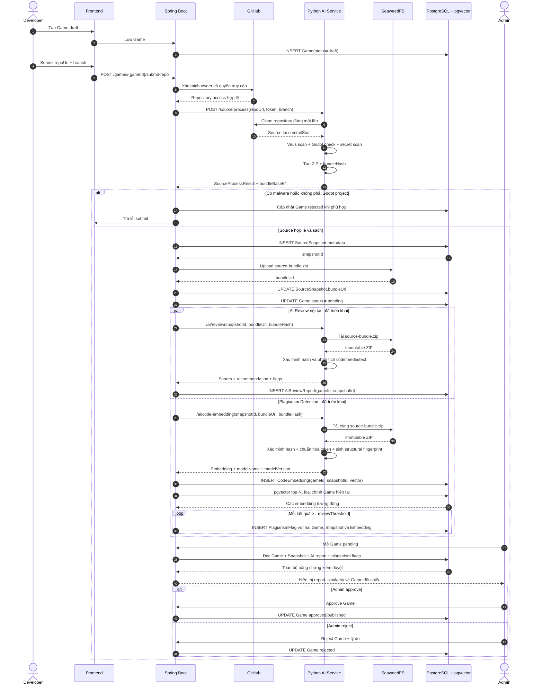
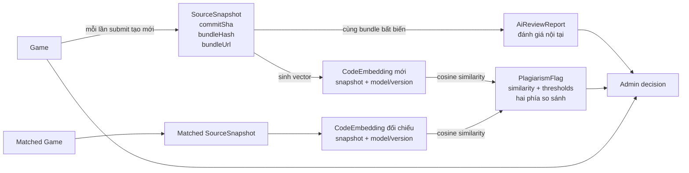
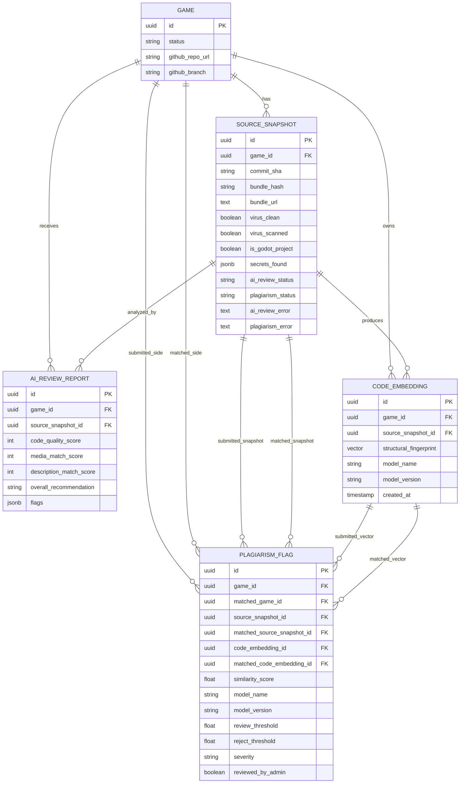

# 06. AI Review và Plagiarism Detection

> Tài liệu này mô tả luồng tổng thể khi developer submit source Game, từ GitHub
> đến khi admin quyết định. AI Review và Plagiarism Detection dùng chung đúng
> một `SourceSnapshot` bất biến, nhưng lưu kết quả ở các bảng khác nhau.

## 1. Mục tiêu và trạng thái triển khai

AI Review trả lời câu hỏi nội tại: source, media, mô tả, category và tag của
chính Game có nhất quán hay không. Plagiarism Detection trả lời câu hỏi liên sản
phẩm: snapshot mới có giống bất thường với snapshot của Game khác hay không.

Hai module được gộp vào cùng luồng submit, không gộp vào cùng entity:

| Thành phần | Vai trò | Trạng thái |
|---|---|---|
| `SourceSnapshot` | Bản source ZIP bất biến của một lần submit | Đã triển khai |
| `AiReviewReport` | Kết quả đánh giá nội tại một snapshot | Đã triển khai |
| `CodeEmbedding` | Fingerprint cấu trúc code của đúng một snapshot và thuật toán/version | Đã triển khai |
| `PlagiarismFlag` | Kết quả so sánh hai embedding/snapshot | Đã triển khai |
| Trạng thái theo snapshot | Phân biệt pending/running/completed/failed | Đã triển khai bằng migration V11 |
| Admin review | Xem report/flag và quyết định cuối | Đã triển khai |

Nguyên tắc bắt buộc:

- GitHub repository chỉ được clone một lần trong mỗi lần submit.
- Virus scan phải sạch trước khi chạy AI và plagiarism.
- AI và plagiarism tải lại đúng `SourceSnapshot.bundleUrl`, không clone GitHub lần hai.
- `bundleHash` phải được xác minh sau khi tải ZIP.
- AI/plagiarism chỉ đề xuất; admin là người approve/reject cuối cùng.

## 2. Mermaid sequence diagram tổng thể

Đoạn Mermaid dưới đây có thể render trực tiếp trên GitHub.



Trong nhánh `par`, hai module độc lập nhưng phải nhận cùng `snapshotId`:

```text
AiReviewReport.source_snapshot_id
    = CodeEmbedding.source_snapshot_id
    = SourceSnapshot.id của lần submit
```

## 3. Mermaid data lineage và entity relationship





## 4. Luồng chi tiết theo entity

| Bước | Xử lý | Entity đọc | Entity ghi |
|---:|---|---|---|
| 1 | Developer tạo draft | `User` | `Game` |
| 2 | Submit GitHub repo + branch | `Game`, `User` | Chưa ghi entity AI |
| 3 | Xác minh ownership/access | `Game`, `User` | Không |
| 4 | Python clone repository đúng một lần | Không | Không |
| 5 | Virus/Godot/secret scan | Không | Chuẩn bị snapshot |
| 6 | Tính `commitSha`, `bundleHash`, tạo ZIP | Không | Chuẩn bị snapshot |
| 7 | Lưu metadata snapshot để lấy UUID | `Game` | `SourceSnapshot` |
| 8 | Upload ZIP theo snapshotId | `SourceSnapshot` | `SourceSnapshot.bundleUrl` |
| 9 | Source sạch và bundle đã lưu | `Game` | `Game.status = pending` |
| 10A | AI tải và xác minh bundle | `Game`, `SourceSnapshot`, `Media`, `Category`, `Tag` | Không |
| 11A | AI phân tích nội tại | Dữ liệu bước 10A | Không |
| 12A | Lưu report | `Game`, `SourceSnapshot` | `AiReviewReport` |
| 10B | Plagiarism tải và xác minh cùng bundle | `Game`, `SourceSnapshot` | Không |
| 11B | Sample code và sinh vector | `SourceSnapshot` | `CodeEmbedding` |
| 12B | Query top-N cosine similarity | `CodeEmbedding` | Không |
| 13B | Kết quả vượt ngưỡng review | Hai phía Game/Snapshot/Embedding | `PlagiarismFlag` |
| 14 | Admin mở trang kiểm duyệt | Tất cả entity trên | Không |
| 15 | Admin quyết định | `Game`, report và flags | `Game`, `PlagiarismFlag.reviewedByAdmin` |

## 5. Trách nhiệm của từng entity

### `SourceSnapshot`

Một bản chụp source bất biến cho một lần submit:

- `commitSha`: commit Git chính xác đã clone.
- `bundleHash`: SHA-256 canonical từ path và hash của từng file.
- `bundleUrl`: vị trí ZIP trên storage:

```text
games/{gameId}/snapshots/{snapshotId}/source-bundle.zip
```

- Kết quả virus, Godot project và secret scan.

Mỗi lần re-submit tạo snapshot mới; không cập nhật nội dung snapshot cũ.

### `AiReviewReport`

Lưu đánh giá nội tại và tham chiếu trực tiếp snapshot đã phân tích:

```text
AiReviewReport -> Game
AiReviewReport -> SourceSnapshot
```

Không dùng JSON `flags` của report để lưu plagiarism vì plagiarism là quan hệ
có cấu trúc giữa hai Game/snapshot.

### `CodeEmbedding`

Lưu fingerprint code của một snapshot. Fingerprint v2 kết hợp 80% shingle cấu
trúc đã chuẩn hóa identifier/literal và 20% shingle token nguyên bản. Không dùng
mean pooling trực tiếp hidden-state CodeBERT vì không gian đó cho cosine gần 1
với cả các project không liên quan:

```text
CodeEmbedding
  -> Game
  -> SourceSnapshot
  -> algorithmName + algorithmVersion
  -> vector(768)
```

Ràng buộc unique:

```text
(source_snapshot_id, model_name, model_version)
```

Một snapshot có thể được tính lại bằng thuật toán mới, nhưng không được tạo trùng
fingerprint của cùng algorithm/version.

### `PlagiarismFlag`

Lưu đầy đủ hai phía của phép so sánh:

| Phía mới submit | Phía được đối chiếu |
|---|---|
| `game_id` | `matched_game_id` |
| `source_snapshot_id` | `matched_source_snapshot_id` |
| `code_embedding_id` | `matched_code_embedding_id` |

Ngoài ra lưu:

- `similarityScore`: cosine similarity từ `0.0` đến `1.0`.
- `modelName`, `modelVersion`: thuật toán fingerprint thực sự đã dùng cho cả hai vector.
- `reviewThreshold`, `rejectThreshold`: ngưỡng tại đúng thời điểm chạy.
- `severity`: `review` hoặc `reject`.
- `reviewedByAdmin`: admin đã xử lý flag hay chưa.

Composite foreign key của migration V10 bảo đảm hai chuỗi sau không bị ghép chéo:

```text
Game mới -> Snapshot mới -> Embedding mới
Game cũ  -> Snapshot cũ  -> Embedding cũ
```

## 6. Quy tắc so sánh và threshold

Khi query pgvector phải loại:

- Chính embedding vừa tạo.
- Embedding thuộc cùng `game_id`, tránh Game bị đánh dấu là đạo nhái chính phiên bản trước của nó.
- Fingerprint sinh bởi algorithm/version khác, vì vector từ hai phiên bản khác nhau không
  nằm trong cùng không gian và không thể so cosine trực tiếp.

Ngưỡng khởi đầu:

| Similarity | Kết quả |
|---:|---|
| `< 0.70` | Không tạo flag |
| `>= 0.70` và `< 0.90` | Tạo flag `review` |
| `>= 0.90` | Tạo flag `reject` đề xuất |

Không tự động reject Game, kể cả similarity rất cao. Admin cần xem khả năng hai
Game cùng sử dụng template/plugin được cấp phép.

## 7. Trạng thái xử lý và điều kiện để admin review

Admin UI đọc trực tiếp trạng thái bền vững của snapshot:

```text
SourceSnapshot.aiReviewStatus
SourceSnapshot.plagiarismStatus
```

Mỗi trạng thái nhận một trong bốn giá trị:

```text
pending -> running -> completed
                   -> failed
```

Các trường lỗi và thời gian hoàn tất:

```text
aiReviewError
aiReviewCompletedAt
plagiarismError
plagiarismCompletedAt
```

Do đó `plagiarismStatus = completed` và danh sách flag rỗng có nghĩa rõ ràng là
đã kiểm tra thành công nhưng không có kết quả vượt ngưỡng. Trạng thái
`completed` chỉ được ghi sau khi transaction lưu embedding/flags đã commit.

## 8. Phạm vi và kế hoạch triển khai

### Giai đoạn 1: source code Game

- [x] `SourceSnapshot` bất biến và bundle path theo snapshot UUID.
- [x] `AiReviewReport.sourceSnapshot`.
- [x] `CodeEmbedding` gắn Game, SourceSnapshot và model/version.
- [x] `PlagiarismFlag` giữ hai Game, snapshot, embedding và threshold.
- [x] Migration V10 với constraint/index phục vụ audit.
- [x] Structural fingerprint có version; chuẩn hóa token và feature hashing xác định.
- [x] Trạng thái AI/plagiarism bền vững trên từng `SourceSnapshot`.
- [x] Python endpoint `/ai/code-embedding` tải bundle và xác minh hash.
- [x] Backend orchestration chạy sau khi transaction snapshot commit.
- [x] Repository pgvector top-N, loại cùng Game và model/version khác.
- [x] Admin overview API, polling trạng thái và UI xem plagiarism flags.

### Giai đoạn 2: asset/media

- [ ] Thiết kế embedding riêng phù hợp ảnh, model 3D và audio.
- [ ] Không tái sử dụng trực tiếp schema Game hiện tại nếu quan hệ Asset khác đáng kể.
- [ ] Chỉ chạy sau virus scan sạch và sau khi developer hoàn tất media/submit review.

### Giai đoạn 3: chất lượng

- [ ] Tinh chỉnh ngưỡng theo dữ liệu thật.
- [ ] Whitelist boilerplate và plugin Godot phổ biến.
- [ ] Lưu bằng chứng đoạn/file giống nhau để admin xem side-by-side.
- [ ] Theo dõi false positive và model drift theo version.

## 9. Quan hệ với `SourceCommit` và Dispute

`SourceCommit` không thay thế `SourceSnapshot` hoặc plagiarism:

- `SourceSnapshot`: bằng chứng source bất biến tại lần submit.
- `CodeEmbedding`/`PlagiarismFlag`: phát hiện chủ động giữa nhiều sản phẩm.
- `SourceCommit`: timeline Git nhẹ để hỗ trợ điều tra khi có dispute.
- `Dispute`: quy trình xử lý khiếu nại sau khi phát sinh tranh chấp.

Luồng submit không nên phụ thuộc vào `SourceCommit` nếu phần thu thập lịch sử
commit chưa được triển khai. Tài liệu/diagram chỉ được đánh dấu bước này là đang
chạy khi backend thực sự ghi `SourceCommit`.
