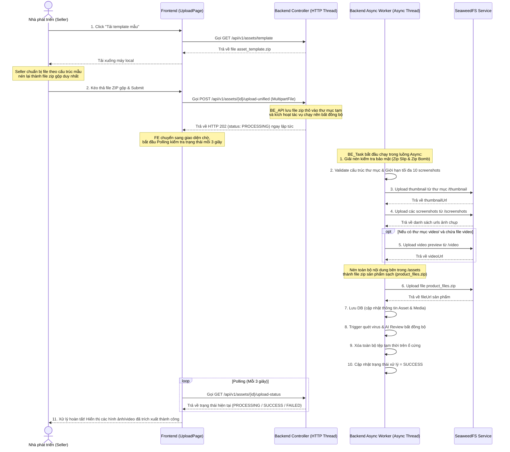

# 20. Kế hoạch: Unified Asset Upload Flow (Gộp upload asset bằng thư mục zip)

> Tài liệu này mô tả chi tiết thiết kế luồng tải lên tài nguyên (Asset Marketplace) mới: thay vì nhà phát triển (Seller) phải upload từng thành phần thủ công (thumbnail, screenshots, video, file zip), họ sẽ tải xuống một file template mẫu và chỉ cần tải lên một file ZIP duy nhất chứa đầy đủ cấu trúc quy định. Hệ thống Backend sẽ tự động giải nén, phân tách và xử lý lưu trữ ở chế độ chạy nền (bất đồng bộ) để phòng ngừa Timeout và các lỗi bảo mật.

---

## 1. Nguyên tắc nghiệp vụ (Business Rules)

### 1.1 Trải nghiệm người dùng hiện tại và cải tiến
- **Hiện trạng:** Khi đăng bán một Asset trên Marketplace, tại Bước 2 của trang Upload (`UploadPage.tsx`), người dùng phải tải lên:
  - File ZIP chứa asset chính thức.
  - File ảnh đại diện (Thumbnail).
  - Nhiều file ảnh chụp màn hình (Screenshots).
  - File video preview (nếu có).
  Điều này yêu cầu nhiều lần chọn file, nhiều API request độc lập, dễ gây lỗi giữa chừng và tốn thao tác của Seller.
- **Giải pháp mới:** 
  - Hiển thị 1 khu vực hướng dẫn người dùng cấu trúc thư mục và cung cấp nút tải xuống **File Template mẫu (`asset_template.zip`)**.
  - Người dùng chuẩn bị toàn bộ file mô tả + file sản phẩm vào đúng các thư mục con tương ứng, nén lại thành 1 file ZIP lớn và upload lên hệ thống.
  - Hệ thống sẽ tự động phân tích thư mục để lấy các tài nguyên tương ứng bằng tác vụ chạy nền (Asynchronous Background Task).

### 1.2 Cấu trúc thư mục Template mẫu (`asset_template.zip`)
Cây thư mục chuẩn bắt buộc phải có cấu trúc như sau:
```text
asset_template/
├── thumbnail/
│   └── thumbnail.png (hoặc .jpg, .jpeg - Chỉ chấp nhận tối đa 1 file ảnh)
├── screenshots/
│   ├── screenshot_1.png
│   ├── screenshot_2.png
│   └── ... (chấp nhận tối đa 10 file ảnh mô tả sản phẩm)
├── video/
│   └── preview.mp4 (hoặc .mov, .avi - Tùy chọn, tối đa 1 file video)
└── assets/
    └── [Chứa toàn bộ các file dự án, code, mô hình 3D, audio... bán cho khách hàng]
```

### 1.3 Quy tắc xử lý giải nén và phân tách tại Backend
Khi Backend nhận được file ZIP lớn từ Seller:
1. **Lưu trữ & Trả phản hồi nhanh:** Lưu file zip nhận được vào ổ cứng tạm và trả về phản hồi `202 Accepted` ngay lập tức.
2. **Giải nén tạm thời (Chạy nền):** Giải nén file ZIP vào một thư mục tạm thời trên server sử dụng tác vụ bất đồng bộ.
3. **Xác thực cấu trúc & Giới hạn số lượng (Validation):**
   - Phải tồn tại thư mục `thumbnail/` chứa ít nhất 1 file ảnh hợp lệ.
   - Thư mục `screenshots/` chứa **tối đa 10 file ảnh**. Nếu vượt quá giới hạn này, dừng quá trình xử lý, cập nhật trạng thái lỗi `EXCEEDED_MAX_SCREENSHOTS` để báo lại cho Seller.
   - Phải tồn tại thư mục `assets/` chứa nội dung sản phẩm. Nếu thư mục rỗng, báo lỗi.
4. **Xử lý Thumbnail:**
   - Đọc file ảnh đầu tiên trong thư mục `thumbnail/`.
   - Upload lên SeaweedFS qua `seaweedFsService`.
   - Gán URL trả về vào trường `thumbnailUrl` của `Asset`.
5. **Xử lý Screenshots:**
   - Quét tất cả file ảnh trong thư mục `screenshots/` (đã đảm bảo <= 10 file).
   - Với mỗi file, upload lên SeaweedFS và tạo bản ghi `Media` với `mediaType = 'screenshot'` liên kết với `Asset` đó.
6. **Xử lý Video (nếu có):**
   - Đọc file video đầu tiên trong thư mục `video/`.
   - Upload lên SeaweedFS và tạo bản ghi `Media` với `mediaType = 'video'` liên kết với `Asset`.
7. **Xử lý Sản phẩm tải về (Assets):**
   - **Quan trọng:** Chỉ đóng gói các tệp tin và thư mục con nằm **bên trong** thư mục `assets/` thành một file ZIP mới (ví dụ: `product_files.zip`).
   - File ZIP tinh lọc này được upload lên SeaweedFS làm file sản phẩm chính thức (`item.setFileUrl(...)`). Điều này đảm bảo người mua sau khi thanh toán chỉ nhận được file sản phẩm sạch, không bị lẫn ảnh thumbnail hay video quảng cáo của người bán.
8. **Kích hoạt quét bảo mật & AI Review:**
   - Gửi file sản phẩm chính thức đi quét virus (`asyncVirusScanService.scanAndProcessAsset`) và chạy AI review (`aiReviewService.reviewAssetAsync`).
9. **Dọn dẹp:** Xóa toàn bộ file và thư mục tạm thời đã giải nén trên server để tránh rò rỉ dung lượng ổ đĩa.

---

## 2. Giải pháp cho các vấn đề Bảo mật & Hiệu năng (Security & Performance Resolutions)

### 2.1 Phòng chống lỗi bảo mật giải nén (Zip Slip & Zip Bomb)

#### A. Ngăn chặn Zip Slip (Directory Traversal)
- **Rủi ro:** Hacker có thể chèn các đường dẫn tương đối dạng `../../etc/passwd` hoặc ghi đè lên các thư mục chạy của hệ thống khi giải nén.
- **Giải pháp:** Khi duyệt qua từng entry của file ZIP, Backend bắt buộc phải chuẩn hóa đường dẫn đích và kiểm tra xem nó có nằm bên ngoài thư mục tạm thời được chỉ định hay không.
- **Mẫu mã nguồn xử lý:**
  ```java
  File destDir = new File(System.getProperty("java.io.tmpdir"), "unified-upload-" + assetId);
  ZipEntry entry = zipInputStream.getNextEntry();
  while (entry != null) {
      File targetFile = new File(destDir, entry.getName());
      String canonicalPath = targetFile.getCanonicalPath();
      if (!canonicalPath.startsWith(destDir.getCanonicalPath() + File.separator)) {
          throw new SecurityException("Zip Slip detected! Tên file không hợp lệ: " + entry.getName());
      }
      // Tiến hành giải nén...
  }
  ```

#### B. Ngăn chặn Zip Bomb (Denial of Service)
- **Rủi ro:** File ZIP có dung lượng cực nhỏ nhưng khi giải nén có thể nở ra hàng trăm GB làm tràn đĩa cứng, RAM hoặc treo CPU (ví dụ: tỉ lệ nén 1000:1).
- **Giải pháp:** Thiết lập các ngưỡng giới hạn cứng trong quá trình đọc luồng giải nén:
  - **Tỉ lệ nén tối đa (Max Compression Ratio):** `100:1`. Nếu tỉ lệ kích thước giải nén / kích thước nén của một file lớn hơn 100, lập tức hủy tiến trình.
  - **Dung lượng giải nén tối đa (Max Uncompressed Size):** `500 MB` đối với Asset Marketplace. Trong lúc ghi luồng giải nén, cộng dồn số byte đã ghi. Nếu vượt quá `500 MB`, dừng ngay lập tức và xóa file tạm.
  - **Giới hạn số lượng file tối đa (Max Entry Count):** Tối đa `1000` entry trong file ZIP.
  - **Mẫu mã nguồn kiểm tra dung lượng cộng dồn:**
    ```java
    long totalSize = 0;
    byte[] buffer = new byte[4096];
    int len;
    while ((len = zipInputStream.read(buffer)) > 0) {
        totalSize += len;
        if (totalSize > MAX_UNCOMPRESSED_SIZE_BYTES) {
            throw new IllegalArgumentException("Zip Bomb detected! Vượt quá dung lượng giải nén tối đa cho phép.");
        }
        fileOutputStream.write(buffer, 0, len);
    }
    ```

---

### 2.2 Xử lý HTTP Timeout bằng Tác vụ Bất đồng bộ (Async Background Processing)
- **Vấn đề:** Quá trình giải nén -> Validate -> Upload nhiều file con (ảnh, video) lên SeaweedFS -> Zip lại `/assets` -> Ghi DB mất từ 30s đến 3 phút tùy dung lượng. Việc xử lý đồng bộ trên luồng HTTP Request sẽ gây lỗi **Gateway Timeout (504)** từ Nginx, Cloudflare hoặc client.
- **Giải pháp:**
  1. API nhận file zip từ client, lưu tạm vào một file nén thô trên server và trả về trạng thái `202 Accepted` ngay lập tức (chỉ mất 1-2 giây).
  2. Khởi chạy một tiến trình chạy nền sử dụng `@Async` trong Spring Boot để xử lý giải nén, validate và cập nhật dữ liệu.
  3. Quản lý trạng thái xử lý thông qua một trường trạng thái tải lên mới hoặc lưu vào bộ nhớ cache (Redis/Database): `uploadStatus = PENDING_UPLOAD | PROCESSING | SUCCESS | FAILED (kèm lý do lỗi)`.
  4. Người dùng sẽ nhận được thông báo qua **WebSocket** khi hoàn tất, hoặc Frontend sẽ thực hiện **Polling (gọi API lấy trạng thái định kỳ 3 giây)** để hiển thị kết quả cho người dùng.

---

## 3. Thiết kế API & Cơ sở Dữ liệu

### 3.1 Cấu trúc Cơ sở Dữ liệu
- Giữ nguyên thiết kế DB hiện tại. Không cần thêm bảng mới vì các thực thể `Asset` và `Media` đã hỗ trợ đầy đủ các trường thông tin cần thiết.
- Trạng thái xử lý file zip được theo dõi thông qua thuộc tính trạng thái trong bộ nhớ hoặc cập nhật trực tiếp vào trường lỗi của sản phẩm nếu quá trình xử lý thất bại.

### 3.2 Đặc tả API (Backend)

#### A. Tải xuống file Template mẫu
- **Endpoint:** `GET /api/v1/assets/template`
- **Mô tả:** Trả về file `asset_template.zip` dưới dạng stream file nhị phân để Seller tải về từ trình duyệt.
- **Quy trình:** Server đọc file tĩnh được đặt tại thư mục tài nguyên của backend: `src/main/resources/static/templates/asset_template.zip`.

#### B. Upload file ZIP gộp (Bất đồng bộ)
- **Endpoint:** `POST /api/v1/assets/{id}/upload-unified`
- **Method:** `POST`
- **Content-Type:** `multipart/form-data`
- **Body:** `file` (MultipartFile - file zip chứa toàn bộ cấu trúc)
- **Response trả về ngay lập tức (HTTP 202):**
  ```json
  {
    "success": true,
    "code": "PROCESSING",
    "message": "File đã được tải lên thành công và đang được xử lý trong nền.",
    "data": {
      "assetId": "...",
      "status": "PROCESSING"
    }
  }
  ```

#### C. API Polling kiểm tra trạng thái xử lý
- **Endpoint:** `GET /api/v1/assets/{id}/upload-status`
- **Method:** `GET`
- **Response:**
  ```json
  {
    "success": true,
    "code": "SUCCESS",
    "data": {
      "assetId": "...",
      "status": "SUCCESS", // PROCESSING | SUCCESS | FAILED
      "errorMessage": null, // Có giá trị nếu status là FAILED
      "extractedMedia": {
        "thumbnailUrl": "https://storage.godotlaunch.com/...",
        "screenshots": [
          "https://storage.godotlaunch.com/...",
          "https://storage.godotlaunch.com/..."
        ],
        "videoUrl": "https://storage.godotlaunch.com/..."
      }
    }
  }
  ```

---

## 4. Quy trình Nghiệp vụ chi tiết (Sequence Diagram)



---

## 5. Các bước triển khai chi tiết (Implementation Steps)

### 5.1 Backend (Java Spring Boot)

1. **Chuẩn bị File Template tĩnh:**
   - Tạo file `asset_template.zip` chứa cấu trúc rỗng và lưu trữ tại đường dẫn: `src/main/resources/static/templates/asset_template.zip`.

2. **Tạo Endpoint tải template trong [`AssetController.java`](file:///C:/Users/Admin/Desktop/SEP/godot-launch-capstone/backend/src/main/java/com/godotlaunch/backend/controller/AssetController.java):**
   ```java
   @GetMapping("/template")
   public ResponseEntity<Resource> downloadTemplate() {
       Resource resource = new ClassPathResource("static/templates/asset_template.zip");
       return ResponseEntity.ok()
               .header(HttpHeaders.CONTENT_DISPOSITION, "attachment; filename=\"asset_template.zip\"")
               .contentType(MediaType.APPLICATION_OCTET_STREAM)
               .body(resource);
   }
   ```

3. **Cấu hình Async Task Executor:**
   - Đảm bảo dự án đã kích hoạt `@EnableAsync`.
   - Cấu hình ThreadPoolTaskExecutor để quản lý luồng xử lý nền hiệu quả.

4. **Thêm phương thức xử lý upload bất đồng bộ trong [`AssetServiceImpl.java`](file:///C:/Users/Admin/Desktop/SEP/godot-launch-capstone/backend/src/main/java/com/godotlaunch/backend/service/impl/AssetServiceImpl.java):**
   - Viết phương thức controller nhận file và lưu tạm ra đĩa, sau đó gọi phương thức `@Async` trong `AssetService` để xử lý.
   - Trong phương thức chạy nền, triển khai các lớp phòng thủ:
     - Giải nén an toàn: Check Zip Slip và Zip Bomb theo công thức ở phần 2.1.
     - Kiểm tra giới hạn số lượng ảnh screenshots: `screenshotsDir.listFiles().length <= 10`.
     - Đóng gói thư mục con `/assets` và upload.
     - Cập nhật thông tin vào cơ sở dữ liệu và dọn dẹp file tạm ở khối `finally`.

---

### 5.2 Frontend (React & TypeScript)

1. **Khai báo API mới trong [`marketplaceApi.ts`](file:///C:/Users/Admin/Desktop/SEP/godot-launch-capstone/frontend/src/api/marketplaceApi.ts):**
   - Thêm hàm `uploadUnifiedAsset(id: string, file: File)` gọi tới API `/api/v1/assets/{id}/upload-unified`.
   - Thêm hàm `getUploadStatus(id: string)` gọi tới API `/api/v1/assets/{id}/upload-status` để thực hiện polling.
   - Thêm nút tải file template mẫu.

2. **Cập nhật giao diện Step 2 của Marketplace Asset tại [`UploadPage.tsx`](file:///C:/Users/Admin/Desktop/SEP/godot-launch-capstone/frontend/src/page/UploadPage.tsx):**
   - **Phần hướng dẫn:** Hiển thị sơ đồ cây cấu trúc thư mục quy định sinh động.
   - **Nút tải template:** Đặt nút **"Tải File Mẫu Template"** nổi bật.
   - **Kéo thả upload:** Thay thế 4 nút upload cũ thành 1 khu vực kéo thả duy nhất cho file ZIP gộp.
   - **Xử lý trạng thái Polling:**
     - Khi upload xong file zip thô, hiển thị giao diện tải đang xử lý: "Đang tải lên..." -> "Đang trích xuất và tối ưu hóa tài nguyên (Quá trình này chạy nền và không làm nghẽn trình duyệt)..." kèm một spinner.
     - Sử dụng `setInterval` để gọi `getUploadStatus` mỗi 3 giây.
     - Khi nhận được trạng thái `SUCCESS`, hủy interval, hiển thị preview ảnh/video và nút hoàn tất.
     - Khi nhận được trạng thái `FAILED`, hiển thị thông tin lỗi chi tiết (ví dụ: phát hiện Zip Slip, vượt quá giới hạn 10 screenshots) để người dùng sửa đổi.

---

## 6. Kế hoạch kiểm thử & Nghiệm thu (Verification)

### 6.1 Các kịch bản kiểm thử (Manual Verification)
1. **Kiểm thử Zip Slip:** Tạo một file zip chứa entry có tên `../../malicious.txt` và upload thử -> Đảm bảo Backend phát hiện và chặn đứng lập tức, ghi nhận lỗi bảo mật.
2. **Kiểm thử Zip Bomb:** Tạo một file zip có tỉ lệ nén siêu lớn hoặc giải nén vượt quá 500MB -> Đảm bảo Backend ngắt luồng ghi, xóa file tạm và báo lỗi thay vì làm tràn đĩa hệ thống.
3. **Kiểm thử Screenshots Limit:** Đặt 12 file ảnh vào thư mục `screenshots/` -> Đảm bảo Backend báo lỗi từ chối vì vượt quá giới hạn 10 ảnh.
4. **Kiểm thử Tránh Timeout (Async):** Upload một file zip lớn (~200MB) -> Xác nhận request HTTP phản hồi ngay lập tức sau khi upload hoàn thành, giao diện chuyển sang trạng thái chờ giải nén nền và tự động hoàn thành thành công sau vài chục giây mà không bị lỗi timeout 504.
