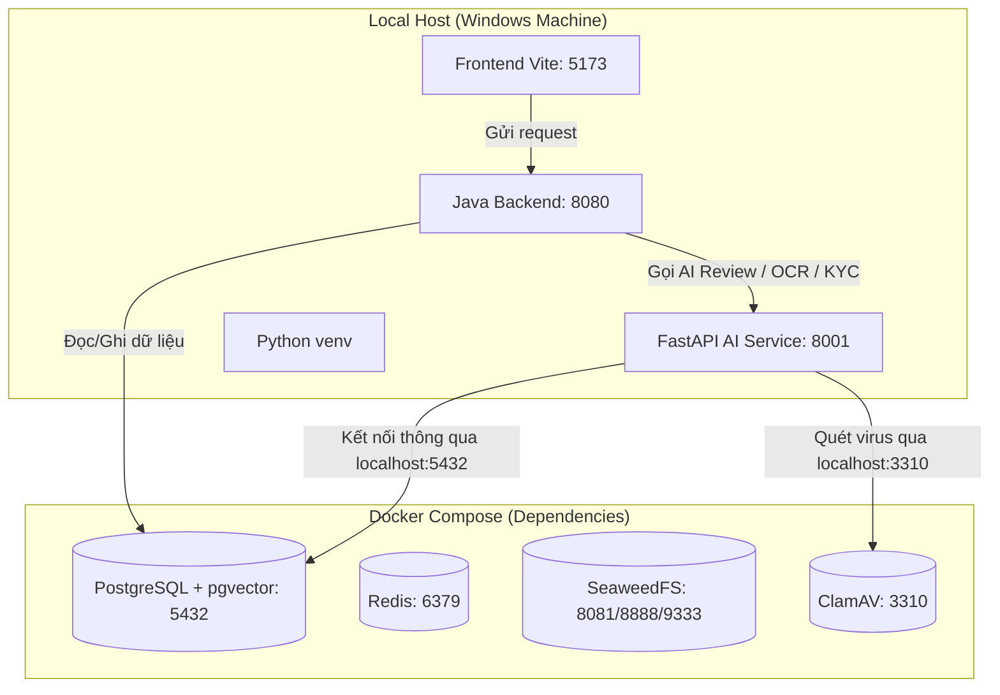

# 22. Kế hoạch: Local AI Service Setup Plan (Tối ưu hóa chạy Python AI Service qua venv máy local)

> Tài liệu này mô tả chi tiết kế hoạch tối ưu hóa luồng làm việc của Python AI Service bằng cách đưa dịch vụ ra chạy trực tiếp tại môi trường máy phát triển (local host) thông qua Python Virtual Environment (venv) thay vì đóng gói trong Docker Compose. Giải pháp này giúp developer bắt log chính xác hơn, sửa code nhận phản hồi tức thì (hot reload), và gỡ lỗi (debug) thuận tiện hơn trong quá trình tích hợp với Backend Java.

---

## 1. Nguyên nhân cải tiến & Mục tiêu (Rationale & Goal)

### 1.1 Khó khăn hiện tại khi chạy qua Docker Compose
*   **Debug & Bắt log khó khăn:** Toàn bộ log của AI Service bị gom chung vào console của Docker, khó lọc tìm log lỗi của các module phân tích code/DeepSeek.
*   **Build chậm (Slow Iteration):** Mỗi khi có sự thay đổi về logic hoặc prompt bên trong code Python, Docker phải build lại image hoặc restart container. Quá trình cài đặt và biên dịch thư viện C++ (`dlib` phục vụ KYC khuôn mặt) mất từ 5 - 10 phút, gây nghẽn tiến độ phát triển của developer.
*   **WSL2 Mount Delay:** Việc đồng bộ file từ hệ điều hành Windows vào Docker Container (chạy qua WSL2) đôi khi bị chậm trễ hoặc kẹt, khiến tính năng tự động reload của FastAPI/Uvicorn không hoạt động ổn định.

### 1.2 Mục tiêu đạt được
*   **Hot Reload thời gian thực:** Developer sửa bất kỳ dòng code Python nào, Uvicorn sẽ reload ngay lập tức trong `< 1 giây`.
*   **Log tách biệt rõ ràng:** Cửa sổ Terminal riêng cho AI Service hiển thị log trực quan có màu sắc định dạng, hỗ trợ tìm kiếm và debug tức thì.
*   **Debug từng dòng (Step-by-step Debugging):** Có thể tích hợp debugger của PyCharm/VS Code để đặt điểm dừng (breakpoint) trực tiếp trên máy host.
*   **Không ảnh hưởng Backend:** Bản thân Backend Java đã cấu hình sẵn fallback gọi tới `http://localhost:8001`. Do đó, khi đưa AI Service ra chạy local trên cổng `8001`, Backend tích hợp hoàn toàn trong suốt không cần sửa code Java.

---

## 2. Mô hình Kiến trúc Luồng Local (Architecture Overview)



Khi chạy theo kiến trúc mới:
1. Docker Compose chỉ chịu trách nhiệm chạy các dịch vụ lưu trữ và cơ sở dữ liệu (`Postgres`, `Redis`, `SeaweedFS`, `MongoDB`, `ClamAV`). Cổng `5432` của Postgres và `3310` của ClamAV được forward ra máy host Windows.
2. Python AI Service chạy bằng môi trường ảo `venv` trực tiếp trên Windows, kết nối tới DB qua `localhost:5432`.
3. Java Backend chạy bằng Maven trên Windows, kết nối tới DB qua `localhost:5432` và kết nối sang AI Service qua `http://localhost:8001`.

---

## 3. Các bước Triển khai chi tiết (Step-by-Step Implementation)

### 3.1 Cấu hình lại Docker Compose
Vô hiệu hóa container `ai-service` trong file `docker-compose.yml` để tránh xung đột cổng `8001` và tiết kiệm tài nguyên hệ thống:
```yaml
# docker-compose.yml (Comment out or remove the ai-service definition)
#  ai-service:
#    build: ./ai-service
#    container_name: godotlaunch-ai-service
#    ports:
#      - "8001:8001"
#    ...
```

### 3.2 Tạo file môi trường local `.env` cho Python
Tạo file [ai-service/.env](file:///c:/Users/Admin/Desktop/SEP/godot-launch-capstone/ai-service/.env) chứa các tham số để ứng dụng kết nối tới cơ sở dữ liệu Postgres trong Docker:
```env


### 3.3 Thiết lập Script tự động khởi tạo Môi trường ảo (`setup-venv.bat`)
Tạo script [ai-service/setup-venv.bat](file:///c:/Users/Admin/Desktop/SEP/godot-launch-capstone/ai-service/setup-venv.bat) để tự động hóa toàn bộ việc cài đặt thư viện cần thiết:
1. Tạo môi trường ảo `venv` nếu chưa tồn tại.
2. Kích hoạt `venv` và cập nhật `pip`.
3. Cài đặt thư viện `cmake` (cần thiết cho quá trình cài đặt thư viện biên dịch dlib).
4. Cài đặt PyTorch bản CPU-only (`torch==2.2.2 --index-url https://download.pytorch.org/whl/cpu`) để tiết kiệm dung lượng đĩa và RAM.
5. Cài đặt các thư viện trong `requirements.txt`.

### 3.4 Thiết lập Script chạy nhanh AI Service (`run-ai.bat`)
Tạo script [ai-service/run-ai.bat](file:///c:/Users/Admin/Desktop/SEP/godot-launch-capstone/ai-service/run-ai.bat) để khởi động nhanh API:
```batch
@echo off
cd /d "%~dp0"
title GodotLaunch Python AI Service
echo Activating Virtual Environment...
call venv\Scripts\activate
echo Starting FastAPI AI Service on http://127.0.0.1:8001 ...
uvicorn main:app --host 127.0.0.1 --port 8001 --reload
pause
```

### 3.5 Cải tiến Launcher chung của dự án (`start-dev.bat`)
Cải tiến file [start-dev.bat](file:///c:/Users/Admin/Desktop/SEP/godot-launch-capstone/start-dev.bat) ở thư mục gốc:
- Thay thế đường dẫn tuyệt đối cứng `set PROJECT=E:\godot-launch-capstone` bằng `set PROJECT=%~dp0` (lấy thư mục hiện tại của file bat). Điều này giúp script chạy được trên máy của mọi developer mà không cần chỉnh sửa thủ công.
- Tích hợp thêm lệnh mở một cửa sổ cmd mới chạy Python AI Service local.

---

## 4. Kiểm thử tích hợp & Nghiệm thu (Verification)

Sau khi hoàn tất cài đặt, developer thực hiện kiểm thử theo các kịch bản sau:

| Bước | Hành động | Kết quả mong đợi | Trạng thái |
| :--- | :--- | :--- | :---: |
| 1 | Chạy `docker compose up -d` | Các container DB, Redis, SeaweedFS, ClamAV chạy bình thường. Cổng 5432 được mở ra host. | `[ ]` |
| 2 | Chạy `setup-venv.bat` | Khởi tạo venv thành công, cài được `insightface`, `onnxruntime`, `torch CPU` và các package. | `[ ]` |
| 3 | Chạy `run-ai.bat` | Terminal hiển thị thông tin FastAPI lắng nghe tại cổng `8001`. | `[ ]` |
| 4 | Truy cập `http://127.0.0.1:8001/docs` | Hiển thị giao diện Swagger UI chứa danh sách API AI Review và KYC. | `[ ]` |
| 5 | Chạy `start-dev.bat` | Bốn màn hình CMD khởi động đồng loạt: Backend, Frontend, Ngrok và Python AI Service. | `[ ]` |
| 6 | Thử upload/review từ Frontend | Java Backend gửi yêu cầu thành công sang Python AI Service. Cửa sổ AI Service in ra logs chi tiết về kết quả xử lý. | `[ ]` |
