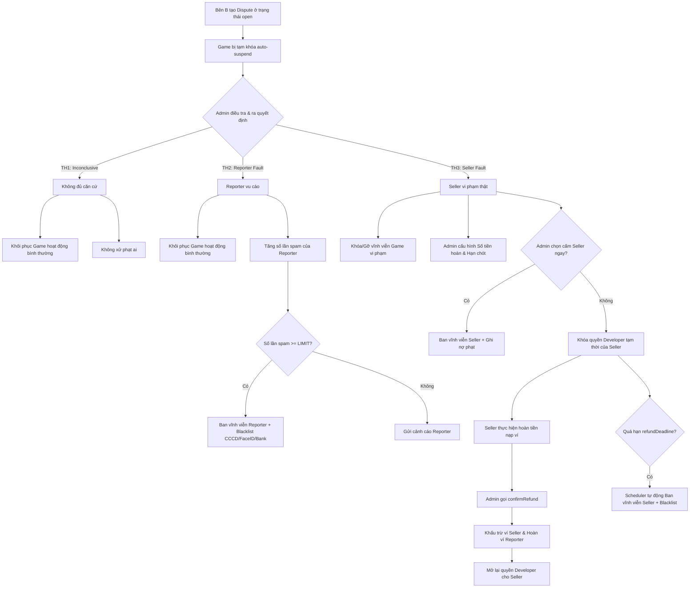

# Kế hoạch & Đặc tả Luồng Tranh chấp Bản quyền (Dispute Workflow Plan)

> **Trạng thái:** Đặc tả luồng nghiệp vụ chi tiết và cây quyết định giải quyết tranh chấp (Dispute).
> **Vai trò:**
> - **Bên A (Reported Seller):** Người bán bị khiếu nại (bị tố vi phạm bản quyền).
> - **Bên B (Reporter):** Người gửi khiếu nại (báo cáo vi phạm bản quyền).
> - **Admin:** Người phán quyết và giải quyết tranh chấp.

---

## 1. Tổng quan Nghiệp vụ

Quy trình Tranh chấp (Dispute) được thiết kế nhằm bảo vệ quyền sở hữu trí tuệ trên nền tảng. Khi một sản phẩm (Game/Asset) bị nghi ngờ vi phạm bản quyền:
1. Hệ thống sẽ tạm thời ẩn/khóa game (`auto-suspend`) để đảm bảo không phát sinh thêm doanh thu bất chính trong quá trình điều tra.
2. Admin sẽ tiến hành thẩm định thủ công dựa trên bằng chứng (commit history, snapshot code, tài liệu).
3. Đưa ra phán quyết theo 3 trường hợp chính dưới đây.

---

## 2. Cây Quyết định & Các Trường hợp Giải quyết (Dispute Scenarios)

### TH1: Không đủ căn cứ kết luận (`resolved_inconclusive`)
*   **Mô tả:** Admin không tìm thấy bằng chứng rõ ràng chứng minh Bên A đạo nhái, hoặc hai bên tự thỏa thuận.
*   **Hành động của hệ thống:**
    *   Khôi phục trạng thái hoạt động của sản phẩm (hủy bỏ `auto-suspend`).
    *   Không xử phạt cả Bên A và Bên B.
    *   Gửi thông báo kết quả giải quyết cho cả hai bên.

### TH2: Bên B vu cáo/báo cáo sai sự thật (`resolved_reporter_fault`)
*   **Mô tả:** Bên B cố tình gửi báo cáo giả mạo mà không có bằng chứng, hoặc bằng chứng chỉ ra Bên A hoàn toàn vô can (ví dụ: A có commit history từ sớm, B chỉ dump 1 commit thô sơ).
*   **Hành động của hệ thống:**
    *   Khôi phục trạng thái hoạt động của sản phẩm cho Bên A.
    *   Tăng biến đếm số lần báo cáo sai sự thật của Bên B (`spamCount`).
    *   Nếu `spamCount >= SPAM_REPORT_LIMIT` (mặc định là 3) hoặc Admin chọn ban thủ công:
        *   Cấm vĩnh viễn tài khoản của Bên B.
        *   Lưu thông tin định danh của Bên B (FaceID embedding, CCCD/Passport, số tài khoản Ngân hàng) vào bảng `banned_identities` để chặn đăng ký hoặc thêm thông tin ngân hàng này vào bất kỳ tài khoản nào khác.
    *   Gửi thông báo cảnh cáo hoặc thông báo cấm tài khoản cho Bên B.

### TH3: Bên A thực sự vi phạm bản quyền (`resolved_seller_fault`)
*   **Mô tả:** Admin phát hiện Bên A đạo nhái hoặc ăn cắp mã nguồn của Bên B.
*   **Hành động của hệ thống:**
    *   Khóa/gỡ vĩnh viễn sản phẩm vi phạm bản quyền khỏi Store.
    *   Admin cấu hình số tiền hoàn trả (`refundAmount`) và hạn chót hoàn trả (`refundDeadline` = `resolvedAt` + X ngày được cấu hình trong `platform_settings`).
    *   **Trường hợp cấm ngay (Admin chọn `banUser = true`):**
        *   Cấm vĩnh viễn tài khoản của Bên A và đưa thông tin vào bảng `banned_identities`.
    *   **Trường hợp cho cơ hội hoàn tiền khắc phục (Admin chọn `banUser = false`):**
        *   Khóa tạm thời quyền Developer của Bên A (`lockedForDispute`).
        *   Seller Bên A bị chặn tạo yêu cầu rút tiền (Withdrawal) và chặn đẩy sản phẩm/cập nhật mới cho tới khi hoàn tất nghĩa vụ trả tiền phạt.
        *   Gửi thông báo yêu cầu nạp tiền và thực hiện nghĩa vụ hoàn trả.
    *   **Quy trình xác nhận hoàn tiền (`confirmRefund`)**:
        *   **Hoàn trả 100% cho Customer (Reporter B):** Khách hàng mua game sẽ nhận lại đầy đủ 100% số tiền đã thanh toán mua sản phẩm ban đầu (bao gồm cả phần doanh thu thực nhận của Developer và phần hoa hồng hệ thống đã thu).
        *   **Thu hồi khoản rút tiền đang tạm giữ (nếu có):** Nếu Developer A có yêu cầu rút tiền đang chờ xử lý (`WithdrawalRequest` ở trạng thái `pending`) bị khóa do dispute, Admin sẽ **từ chối (reject)** yêu cầu rút tiền này. Số tiền đang bị tạm giữ trong `pendingBalance` sẽ được giải phóng trở lại số dư ví khả dụng của Developer A, giúp có đủ số dư để khấu trừ tiền hoàn trả.
        *   **Thực hiện khấu trừ ví:** Hệ thống trừ tiền từ ví của Seller A (`debitSellerRefund`) cho toàn bộ giá trị hoàn trả và cộng tiền vào ví của Reporter B (`creditRestricted` - khoản tiền hoàn này được định danh là tiền nạp bồi hoàn, chỉ dùng mua sắm nội bộ trên platform, không được rút về ngân hàng nhằm tránh hành vi trục lợi hoặc rửa tiền).
        *   **Tạo Transaction Logs:** Tạo log Transaction hoàn tiền (`TxnType.refund`) cho cả ví Seller A và Reporter B.
        *   **Khôi phục quyền Developer:** Khi hoàn trả thành công, mở lại quyền Developer cho Seller A (nếu trước đó bị khóa tạm thời và không bị ban vĩnh viễn).
    *   **Quy trình cưỡng chế quá hạn (Overdue Enforcement)**:
        *   Một Scheduler chạy nền (`DisputeRefundEnforcementScheduler`) định kỳ quét các dispute quá hạn `refundDeadline` mà `refundConfirmedAt` vẫn `null`.
        *   Tiến hành ban vĩnh viễn Seller và đưa danh tính định danh vào danh sách đen `banned_identities`.

---

## 3. Cấu trúc Thực thể & Quan hệ Dữ liệu

### 3.1 Thực thể `Dispute`
Nằm tại [Dispute.java](file:///c:/Users/Admin/Desktop/SEP/godot-launch-capstone/backend/src/main/java/com/godotlaunch/backend/entity/Dispute.java).

| Tên trường | Kiểu dữ liệu | Ý nghĩa nghiệp vụ |
| :--- | :--- | :--- |
| `id` | `UUID` | Khóa chính của vụ tranh chấp. |
| `reporter` | `User` (Bên B) | Người gửi khiếu nại báo cáo. |
| `reportedSeller` | `User` (Bên A) | Developer bị khiếu nại. |
| `game` | `Game` | Game đang bị tranh chấp bản quyền. |
| `reason` | `String` (TEXT) | Lý do khiếu nại. |
| `evidenceRepoUrl` | `String` (TEXT) | Link repository chứa bằng chứng. |
| `evidenceNote` | `String` (TEXT) | Mô tả chi tiết bằng chứng. |
| `status` | `DisputeStatus` (Enum) | Trạng thái: `open`, `resolved_seller_fault`, `resolved_reporter_fault`, `resolved_inconclusive`. |
| `resolutionNote` | `String` (TEXT) | Ghi chú giải quyết của Admin. |
| `refundAmount` | `BigDecimal` | Số tiền yêu cầu hoàn trả (TH3). |
| `refundDeadline` | `Instant` | Hạn chót hoàn tiền. |
| `refundConfirmedAt` | `Instant` | Thời gian Admin xác nhận đã hoàn tiền thành công. |
| `resolvedAt` | `Instant` | Thời gian Admin đưa ra phán quyết. |
| `createdAt` | `Instant` | Thời gian tạo báo cáo tranh chấp. |
| `updatedAt` | `Instant` | Thời gian cập nhật trạng thái gần nhất. |

### 3.2 Quan hệ với luồng Rút tiền (Withdrawal)
*   Khi Seller A có một dispute ở trạng thái `open` hoặc tài khoản bị khóa vì nợ tiền hoàn (`lockedForDispute != null`), hệ thống sẽ **chặn toàn bộ yêu cầu rút tiền tự động hoặc thủ công** của Seller này nhằm ngăn chặn hành vi rút sạch tiền rồi bỏ trốn.
*   Cụ thể được cấu hình kiểm tra qua logic `isHeldByDispute` trong [WithdrawalRequestServiceImpl.java](file:///c:/Users/Admin/Desktop/SEP/godot-launch-capstone/backend/src/main/java/com/godotlaunch/backend/service/impl/WithdrawalRequestServiceImpl.java).

---

## 4. Đặc tả API của Luồng Dispute

### 4.1 Cho Người Dùng (Reporter / Seller)
*   **Gửi khiếu nại mới:**
    *   `POST /api/v1/disputes`
    *   *Body:* `CreateDisputeRequest` (`gameId`, `reason`, `evidenceRepoUrl`, `evidenceNote`)
    *   *Quyền hạn:* Đã đăng nhập.
*   **Xem danh sách vụ khiếu nại đã gửi (Reporter):**
    *   `GET /api/v1/disputes/my-reports`
*   **Xem danh sách vụ bị khiếu nại (Seller):**
    *   `GET /api/v1/disputes/my-cases`
*   **Xem chi tiết vụ tranh chấp:**
    *   `GET /api/v1/disputes/{id}`

### 4.2 Cho Admin (Quản trị viên)
*   **Lấy toàn bộ danh sách vụ tranh chấp:**
    *   `GET /api/v1/admin/disputes` (hỗ trợ filter theo status).
*   **Phán quyết giải quyết tranh chấp:**
    *   `POST /api/v1/admin/disputes/{id}/resolve`
    *   *Body:* `ResolveDisputeRequest` (`resolution`, `resolutionNote`, `refundAmount`, `banUser`)
*   **Xác nhận hoàn trả tiền:**
    *   `POST /api/v1/admin/disputes/{id}/confirm-refund`
    *   *Quyền hạn:* Chỉ Admin. Thực hiện khấu trừ tiền ví của Seller và chuyển trả cho Reporter.

---

## 5. Danh Sách Việc Cần Làm (Implementation Tasks)

1.  **Cập nhật cấu hình hệ thống:** Thêm cấu hình `refund_deadline_days` vào bảng cấu hình hệ thống để xác định thời hạn tối đa Seller phải hoàn tiền.
2.  **Viết Scheduler tự động quét trễ hạn (`DisputeRefundEnforcementScheduler`):** Quét hàng ngày/hàng giờ các dispute có trạng thái `resolved_seller_fault`, quá hạn `refundDeadline` mà `refundConfirmedAt` chưa được set để gọi `banOverdueSeller`.
3.  **Tích hợp Identity Blacklist (`banned_identities`):** Khi ban Seller/Reporter, lưu FaceID embedding + CCCD hash + Bank Account hash để chặn đăng ký tài khoản mới.
4.  **Viết Unit Test & Integration Test:**
    *   Test luồng tạo dispute thành công và game bị `auto-suspend`.
    *   Test TH1, TH2, TH3 của `resolveDispute`.
    *   Test luồng hoàn tiền `confirmRefund` kiểm tra giao dịch tiền mặt và mở khóa tài khoản.
    *   Test quá hạn thanh toán và Scheduler ban tài khoản tự động.
