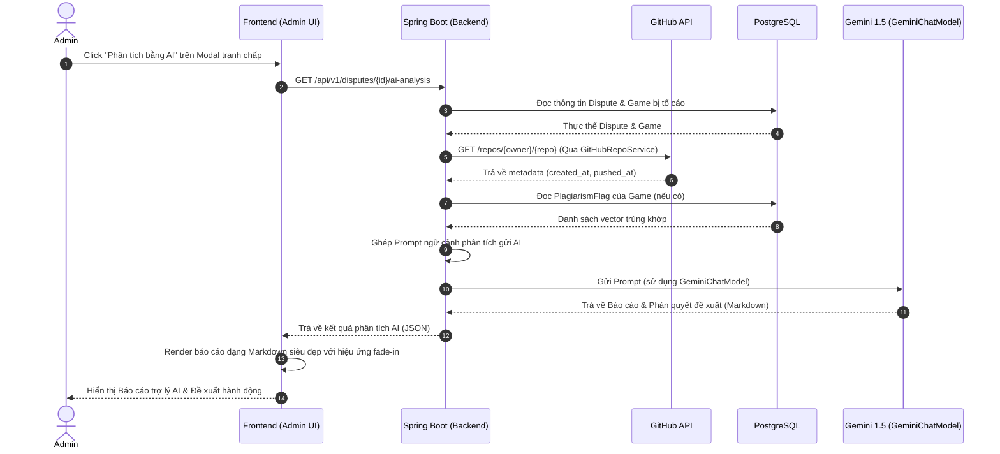

# Đặc tả thiết kế: Trợ lý AI Phân tích & Đề xuất Phán quyết Tranh chấp Bản quyền (AI Dispute Assistant)

Tài liệu này mô tả chi tiết thiết kế kỹ thuật tích hợp Google Gemini AI vào luồng xử lý tranh chấp bản quyền (Dispute) tại trang quản trị Admin, tự động đối chiếu các tiêu chí thời gian đăng tải, mã nguồn trên GitHub, và các chỉ số tương đồng code để đưa ra đề xuất tối ưu cho Admin.

---

## 1. Luồng Quyết định và Tiêu chí của Trợ lý AI
Khi có tranh chấp xảy ra (Developer B tố cáo Game của Developer A đạo nhái, cung cấp kèm link `evidenceRepoUrl` trên GitHub):

### BƯỚC 1: Kiểm tra độ tương đồng mã nguồn (Code Similarity Check)
Hệ thống sẽ lấy chỉ số tương đồng code từ kết quả quét tự động AST/MinHash (pgvector) giữa Game bị tố (A) và Repo của B (hoặc các sản phẩm của B). AI sẽ phân tích theo các ngưỡng sau:
*   **Ngưỡng Đạo nhái cao ($\ge 90\%$)**: Code giống nhau gần như hoàn toàn. Đây là bằng chứng đắt giá nhất. AI sẽ tiếp tục chuyển sang **Bước 2** để xem ai là người tạo ra trước.
*   **Ngưỡng Nghi vấn ($70\% \le \text{Similarity} < 90\%$)**: Code có sự tương đồng đáng kể nhưng chưa cấu thành sao chép 100% (có thể dùng chung thư viện, boilerplate, starter kit hoặc clone một phần). AI sẽ yêu cầu đối chiếu kỹ các file cụ thể và chuyển sang **Bước 2**.
*   **Ngưỡng An toàn ($< 70\%$)**: Không phát hiện sự tương đồng mã nguồn đáng kể. AI sẽ kết luận ngay là **Không đủ bằng chứng đạo nhái code** $\rightarrow$ Đề xuất kết án **Trường hợp 1** (Không đủ căn cứ) hoặc **Trường hợp 2** (Vu cáo - nếu B cố tình tố cáo sai sự thật), trừ khi B cung cấp các bằng chứng phi mã nguồn khác (hình ảnh, video, âm thanh) cực kỳ thuyết phục.

### BƯỚC 2: Đối chiếu mốc thời gian và chủ sở hữu (Timeline & Ownership Check)
Nếu bước 1 phát hiện có sự trùng lặp code nghi vấn ($\ge 70\%$), AI sẽ so khớp thời gian:
*   **A đăng trước - B tạo repo sau**: Game của A đăng bán trước thời điểm Repo của B được tạo hoặc cập nhật $\rightarrow$ A không thể đạo nhái B. Kết luận: **Trường hợp 2 (Reporter vu khống / resolved_reporter_fault)**.
*   **B tạo repo trước - A đăng sau**: Repo của B đã tồn tại và có các commit lịch sử trước khi A đăng game $\rightarrow$ A có hành vi sao chép code của B đem bán. Kết luận: **Trường hợp 3 (Seller vi phạm thật / resolved_seller_fault)**.
*   **Mốc thời gian mập mờ / không thể xác minh**: Không thể xác định rõ ai là người tạo ra trước $\rightarrow$ Kết luận: **Trường hợp 1 (Không đủ căn cứ / resolved_inconclusive)**.

### BƯỚC 3: Tổng hợp báo cáo cho Admin
- Tổng hợp toàn bộ lập luận trên thành báo cáo Markdown với đề xuất phán quyết rõ ràng hiển thị trên giao diện của Admin.

---

## 2. Mermaid Sequence Diagram



---

## 3. Chi tiết thay đổi đề xuất

### 3.1. [MODIFY] [GitHubRepoService.java](file:///c:/Users/Admin/Desktop/SEP/godot-launch-capstone/backend/src/main/java/com/godotlaunch/backend/service/GitHubRepoService.java)
Thêm phương thức lấy metadata thô của repository để lấy thông tin ngày tạo/ngày cập nhật:
```java
    /**
     * Lấy dữ liệu metadata thô của repository từ GitHub API (created_at, pushed_at, owner...)
     */
    java.util.Map<String, Object> getRepoMetadata(String repoUrl);
```

### 3.2. [MODIFY] [GitHubRepoServiceImpl.java](file:///c:/Users/Admin/Desktop/SEP/godot-launch-capstone/backend/src/main/java/com/godotlaunch/backend/service/impl/GitHubRepoServiceImpl.java)
Triển khai phương thức đọc metadata sử dụng WebClient hiện có của hệ thống:
```java
    @Override
    public Map<String, Object> getRepoMetadata(String repoUrl) {
        if (repoUrl == null || repoUrl.isBlank()) return null;
        try {
            String[] ownerRepo = parseOwnerRepo(repoUrl);
            // Thử lấy có token (bot) trước, nếu không được thử không token (public)
            Map<String, Object> data = fetchRepoMetadata(ownerRepo[0], ownerRepo[1]);
            if (data == null) {
                data = fetchRepoMetadataNoAuth(ownerRepo[0], ownerRepo[1]);
            }
            return data;
        } catch (Exception e) {
            log.warn("Không thể fetch metadata cho repo {}: {}", repoUrl, e.getMessage());
            return null;
        }
    }
```

### 3.3. [MODIFY] [DisputeService.java](file:///c:/Users/Admin/Desktop/SEP/godot-launch-capstone/backend/src/main/java/com/godotlaunch/backend/service/DisputeService.java)
Định nghĩa phương thức phân tích khiếu nại bằng AI:
```java
    /** AI phân tích chi tiết đơn khiếu nại bản quyền và đưa ra gợi ý phán quyết cho Admin. */
    String getAiAnalysis(UUID disputeId);
```

### 3.4. [MODIFY] [DisputeServiceImpl.java](file:///c:/Users/Admin/Desktop/SEP/godot-launch-capstone/backend/src/main/java/com/godotlaunch/backend/service/impl/DisputeServiceImpl.java)
- Inject `GeminiChatModel` (Spring AI), `GitHubRepoService`, `SourceSnapshotRepository`, và `PlagiarismFlagRepository`.
- Viết prompt gom các dữ liệu: ngày tạo repo, ngày xuất bản game, các flag trùng lặp AST của hệ thống và gửi cho Gemini:
```java
    @Override
    @Transactional(readOnly = true)
    public String getAiAnalysis(UUID disputeId) {
        Dispute dispute = disputeRepository.findById(disputeId)
                .orElseThrow(() -> new AppException(ErrorCode.DISPUTE_NOT_FOUND));

        // 1. Fetch metadata GitHub của B
        String gitInfo = "Không thể truy cập dữ liệu GitHub của B.";
        if (dispute.getEvidenceRepoUrl() != null) {
            Map<String, Object> repoMeta = gitHubRepoService.getRepoMetadata(dispute.getEvidenceRepoUrl());
            if (repoMeta != null) {
                gitInfo = String.format("- Ngày tạo Repo: %s\n- Cập nhật lần cuối: %s\n- Quyền sở hữu: %s",
                        repoMeta.get("created_at"),
                        repoMeta.get("pushed_at"),
                        ((Map<?,?>)repoMeta.get("owner")).get("login"));
            }
        }

        // 2. Fetch Plagiarism flags của A
        StringBuilder flagsInfo = new StringBuilder();
        SourceSnapshot latestSnapshot = sourceSnapshotRepository.findFirstByGameIdOrderByCreatedAtDesc(dispute.getGame().getId())
                .orElse(null);
        if (latestSnapshot != null) {
            List<PlagiarismFlag> flags = plagiarismFlagRepository.findBySourceSnapshotIdOrderBySimilarityScoreDesc(latestSnapshot.getId());
            if (!flags.isEmpty()) {
                flagsInfo.append("Nghi vấn trùng lặp AST phát hiện:\n");
                for (PlagiarismFlag flag : flags) {
                    flagsInfo.append(String.format("- Game trùng: %s (Trùng khớp: %.2f%%)\n",
                            flag.getMatchedGame().getTitle(), flag.getSimilarityScore() * 100));
                }
            } else {
                flagsInfo.append("Hệ thống tự động không tìm thấy sự trùng lặp code bất thường nào.\n");
            }
        }

        // 3. Xây dựng prompt phân tích cho Gemini
        String prompt = String.format("""
                [Prompt phân tích so khớp gửi Gemini...]
                """);
        
        // Gọi Gemini và trả về kết quả
        var chatResponse = geminiChatModel.call(new Prompt(prompt));
        return chatResponse.getResult().getOutput().getContent();
    }
```

### 3.5. [MODIFY] [DisputeController.java](file:///c:/Users/Admin/Desktop/SEP/godot-launch-capstone/backend/src/main/java/com/godotlaunch/backend/controller/DisputeController.java)
Thêm endpoint phân quyền cho Admin:
```java
    @GetMapping("/{id}/ai-analysis")
    @PreAuthorize("hasRole('ADMIN')")
    @Operation(summary = "AI phân tích và gợi ý hướng phán xử cho Admin")
    public ResponseEntity<ApiResponse<String>> getAiAnalysis(@PathVariable UUID id) {
        return ResponseEntity.ok(ApiResponse.success(disputeService.getAiAnalysis(id), "OK"));
    }
```

### 3.6. [MODIFY] [AdminDisputePanel.tsx](file:///c:/Users/Admin/Desktop/SEP/godot-launch-capstone/frontend/src/components/admin/AdminDisputePanel.tsx)
*   Thêm API call `getAiAnalysis(id)` vào `disputeApi` ở frontend.
*   Trong `ResolveModal`, thêm nút: **"🤖 Phân tích Tranh chấp bằng AI"**
*   Khi Admin nhấn nút, hiển thị trạng thái Loading và gọi API. Sau đó hiển thị báo cáo gợi ý phán xử định dạng Markdown trong một khung Glassmorphism tuyệt đẹp.

---

## 4. Kế hoạch Kiểm thử & Xác thực

1.  **Kiểm tra Biên dịch (Build check)**:
    *   Chạy `mvn compile` kiểm tra Backend.
    *   Chạy `npm run lint` kiểm tra Frontend.
2.  **Kiểm tra tính đúng đắn (API & Prompt)**:
    *   Gửi tố cáo thử nghiệm với repo GitHub public của B.
    *   Admin click nút phân tích AI, kiểm tra xem Gemini có trích xuất đúng ngày tạo repo GitHub và so sánh chính xác với ngày tạo Game trên sàn để đưa ra kết luận (TH1, TH2, hay TH3) hay không.

---

---

## 5. Tách biệt Độc lập hai luồng AI (Chat Box dùng Gemini, Dispute dùng DeepSeek)

Để tránh gây ảnh hưởng chéo và đảm bảo:
*   **Chat Box**: Vẫn chạy bằng Google Gemini thông qua `GeminiChatModel` và key `GEMINI_API_KEY` hiện có.
*   **AI Dispute Assistant (Trợ lý Phán xử)**: Chạy độc lập bằng **DeepSeek** thông qua API Key của DeepSeek.

Chúng ta sẽ thiết kế một luồng gọi trực tiếp độc lập trong dự án:

### 5.1. Bổ sung cấu hình biến môi trường riêng trong `backend/.env`
```env
# Cấu hình DeepSeek (chỉ dùng cho AI Dispute)
DEEPSEEK_API_KEY=sk-your-deepseek-api-key-here
DEEPSEEK_API_URL=https://api.deepseek.com/v1
DEEPSEEK_MODEL=deepseek-chat
```

### 5.2. Triển khai gọi API DeepSeek độc lập trong `DisputeServiceImpl.java`
Chúng ta sử dụng `WebClient` có sẵn của dự án để gửi yêu cầu phân tích trực tiếp tới DeepSeek mà không đi qua Bean `GeminiChatModel`.

```java
    @Value("${DEEPSEEK_API_KEY:}")
    private String deepseekApiKey;

    @Value("${DEEPSEEK_API_URL:https://api.deepseek.com/v1}")
    private String deepseekApiUrl;

    @Value("${DEEPSEEK_MODEL:deepseek-chat}")
    private String deepseekModel;

    private String callDeepSeek(String prompt) {
        if (deepseekApiKey == null || deepseekApiKey.isBlank()) {
            return "Chưa cấu hình DEEPSEEK_API_KEY trong file backend/.env để phân tích.";
        }
        try {
            Map<String, Object> body = Map.of(
                "model", deepseekModel,
                "messages", List.of(
                    Map.of("role", "user", "content", prompt)
                ),
                "temperature", 0.2
            );

            Map<String, Object> response = webClient.post()
                    .uri(deepseekApiUrl + "/chat/completions")
                    .header("Authorization", "Bearer " + deepseekApiKey)
                    .header("Content-Type", "application/json")
                    .bodyValue(body)
                    .retrieve()
                    .bodyToMono(new ParameterizedTypeReference<Map<String, Object>>() {})
                    .block();

            if (response != null && response.containsKey("choices")) {
                List<?> choices = (List<?>) response.get("choices");
                if (!choices.isEmpty()) {
                    Map<?, ?> choice = (Map<?, ?>) choices.get(0);
                    Map<?, ?> message = (Map<?, ?>) choice.get("message");
                    return (String) message.get("content");
                }
            }
            return "Không nhận được phản hồi hợp lệ từ DeepSeek API.";
        } catch (Exception e) {
            log.error("Lỗi khi kết nối tới DeepSeek API: {}", e.getMessage(), e);
            return "Lỗi kết nối DeepSeek: " + e.getMessage();
        }
    }
```
Phương án này đảm bảo không chạm vào bất cứ dòng code nào của tính năng Chat Box, an toàn và tách biệt 100%.


