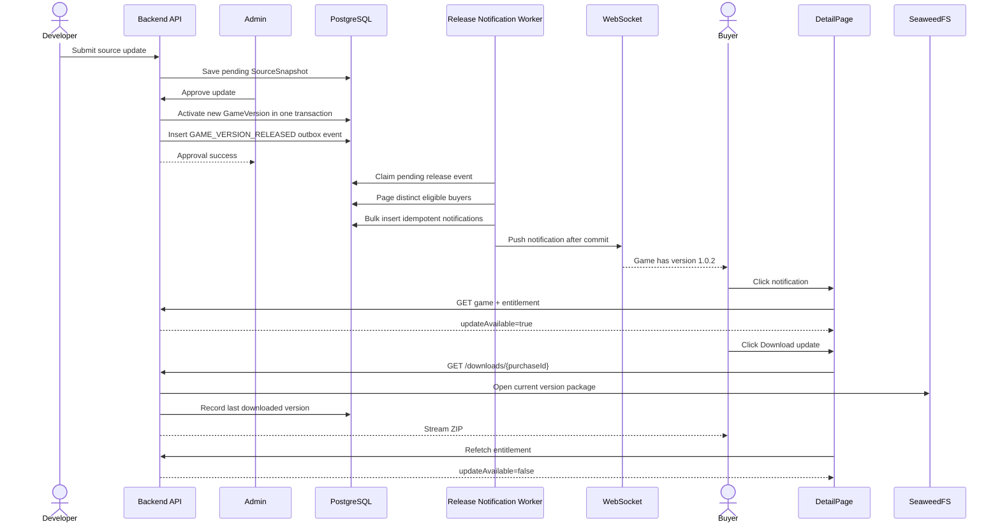

# 25. Kế hoạch thông báo phiên bản game mới cho người đã mua

> Tài liệu này mở rộng luồng cập nhật game tại `16-game-update-flow-plan.md`.
> Phạm vi: khi một bản cập nhật đã được Admin phê duyệt và trở thành
> `GameVersion.isCurrent=true`, tất cả người dùng đã mua game trước thời điểm
> phát hành sẽ nhận thông báo. Khi mở thông báo, người dùng được đưa tới trang
> chi tiết game, thấy trạng thái có bản cập nhật và có thể tải miễn phí phiên
> bản hiện hành.

---

## 1. Mục tiêu sản phẩm

1. Người mua không bỏ lỡ bản vá, nội dung hoặc tính năng mới của game.
2. Quyền mua game là vĩnh viễn: không thu tiền lại khi tải phiên bản mới.
3. Chỉ thông báo khi phiên bản đã được duyệt và phát hành thật sự; không thông
   báo lúc Developer mới upload hoặc khi bản cập nhật còn chờ kiểm duyệt.
4. Một người chỉ nhận tối đa một notification cho cùng một `GameVersion`, kể cả
   worker retry hoặc backend xử lý lại event.
5. Trang Detail phải lấy trạng thái update từ backend, không tin dữ liệu trong
   notification hoặc `sessionStorage`.
6. Download luôn trả bản `is_current=true` và kiểm tra quyền sở hữu ở server.

### Ngoài phạm vi phiên bản đầu

- Không làm delta patch; người dùng tải lại toàn bộ ZIP.
- Không tự cập nhật file đã cài trên máy người dùng.
- Không cho tải phiên bản cũ.
- Không gửi thông báo khi update bị Admin từ chối.
- Push notification hệ điều hành/mobile có thể bổ sung sau; bản đầu dùng DB,
  WebSocket và email preference hiện có.

---

## 2. Hiện trạng trong codebase

| Thành phần | Hiện trạng | Khoảng trống |
|---|---|---|
| `GameVersion` | Có `versionNumber`, `changelog`, `fileUrl`, `isCurrent`, `releasedAt` | Changelog đang hard-code; chưa phát event phát hành |
| `VersionUtils` | Chuyển version cũ về non-current và tạo version mới | Hàm `void`, save nhiều lần, khó lấy chính xác version vừa phát hành |
| `Order` | Một order duy nhất cho `(buyerId, gameId)`; chính là entitlement | Chưa lưu version người mua tải gần nhất |
| `DownloadServiceImpl` | Kiểm tra chủ order và tải version current | Chưa cập nhật download state/version |
| Notification | Có DB, unread count, WebSocket user queue và email | Chưa có type `GAME_VERSION_RELEASED`, metadata và idempotency key |
| `NotificationBell` | Điều hướng theo `type + targetId` | Chưa có nhánh deep-link tới Detail game update |
| `DetailPage` | Hiển thị version hiện hành và nút download nếu suy ra đã mua | Chưa có banner update; ownership đang phụ thuộc payment state phía client |

Nguyên tắc quan trọng: `Order` chỉ được tạo sau khi thanh toán hoàn tất, nên
mọi order có `game_id` là một quyền sở hữu hợp lệ. Không cần lọc payment đang
pending khi chọn danh sách người nhận.

---

## 3. Trải nghiệm người dùng chuẩn

### 3.1 Nội dung notification

```text
Sky Adventure đã có phiên bản 1.0.2
Game bạn đã mua vừa được cập nhật. Xem thay đổi và tải phiên bản mới.
```

Notification lưu:

- `type`: `GAME_VERSION_RELEASED`
- `targetId`: `gameId`
- `metadata.gameVersionId`: ID version vừa phát hành
- `metadata.versionNumber`: `1.0.2`
- `metadata.actionUrl`: `/games/{gameId}?update={gameVersionId}`
- `eventKey`: `game-version-released:{versionId}:{recipientId}`

Không đưa URL file storage vào notification.

### 3.2 Khi người dùng bấm notification

1. Frontend đánh dấu notification đã đọc.
2. Điều hướng tới `/games/{gameId}?update={gameVersionId}`.
3. DetailPage fetch lại game và `GET /api/v1/games/{gameId}/entitlement`.
4. Backend xác nhận user thực sự sở hữu game và so sánh:
   - version hiện hành;
   - version user tải gần nhất.
5. Nếu có update, UI hiển thị banner và CTA **Tải bản cập nhật**.
6. Sau khi backend bắt đầu phục vụ file current thành công, order được cập nhật
   `lastDownloadedGameVersionId`.
7. Frontend refetch entitlement; banner chuyển sang **Bạn đang sử dụng phiên
   bản mới nhất**.

Nếu user đã tải version mới trên thiết bị khác trước khi bấm notification, trang
Detail không được tiếp tục báo update chỉ vì notification còn cũ.

---

## 4. Flow tổng thể



---

## 5. Quy tắc nghiệp vụ

### 5.1 Thời điểm phát hành

Event chỉ được tạo sau khi tất cả điều kiện đúng:

- Admin đã approve pending update;
- version mới đã được lưu;
- version mới là bản duy nhất có `is_current=true`;
- pending snapshot đã được clear;
- transaction activation thành công.

Không phát event ở các thời điểm:

- Developer upload ZIP/repo;
- virus scan hoàn tất;
- AI review hoàn tất;
- Admin reject;
- upload Web Demo nhưng source package/version không thay đổi;
- retry cùng một lần approve.

### 5.2 Người nhận hợp lệ

Người nhận là `DISTINCT orders.buyer_id` thỏa:

```text
orders.game_id = releasedGameId
orders.purchased_at < releasedVersion.releasedAt
buyer vẫn tồn tại
buyer không phải creator của game
```

Người mua sau thời điểm release không nhận notification hồi tố; khi mua, họ đã
nhận ngay version mới nhất.

### 5.3 Xác định có update

```text
owned = order tồn tại cho (currentUser, gameId)

updateAvailable = owned
                  AND currentVersion tồn tại
                  AND lastDownloadedVersionId khác currentVersion.id
                  AND lastDownloadedVersionId không null
```

Nếu user chưa từng download (`lastDownloadedVersionId=null`), UI dùng trạng
thái `FIRST_DOWNLOAD_AVAILABLE`, không gọi là update đã cài.

### 5.4 Nhiều phiên bản phát hành liên tiếp

- Mỗi version có event riêng và idempotency riêng.
- Detail luôn hiển thị version current mới nhất, không tải version ghi trong
  notification cũ.
- Có thể gộp notification chưa đọc của cùng game theo chiến lược latest-wins ở
  phase sau; bản đầu ưu tiên lịch sử release rõ ràng.

---

## 6. Thiết kế dữ liệu

Đề xuất migration tiếp theo: `V33__game_version_update_notifications.sql`.

### 6.1 Theo dõi version đã tải trên entitlement

```sql
ALTER TABLE public.orders
    ADD COLUMN last_downloaded_game_version_id uuid,
    ADD COLUMN last_downloaded_at timestamptz;

ALTER TABLE public.orders
    ADD CONSTRAINT fk_orders_last_downloaded_game_version
    FOREIGN KEY (last_downloaded_game_version_id)
    REFERENCES public.game_versions(id)
    ON DELETE SET NULL;

CREATE INDEX idx_orders_game_buyer
    ON public.orders (game_id, buyer_id)
    WHERE game_id IS NOT NULL;
```

Constraint unique `(buyer_id, game_id)` đã tồn tại và cần giữ nguyên.

### 6.2 Metadata và idempotency cho notification

```sql
ALTER TABLE public.notifications
    ADD COLUMN metadata jsonb NOT NULL DEFAULT '{}'::jsonb,
    ADD COLUMN event_key varchar(255);

CREATE UNIQUE INDEX uq_notifications_event_key
    ON public.notifications (event_key)
    WHERE event_key IS NOT NULL;
```

Không nhồi `gameId`, `versionId`, `route` vào chuỗi message rồi parse ở
frontend. Message chỉ dùng để hiển thị; metadata là dữ liệu điều hướng.

### 6.3 Durable release event/outbox

```sql
CREATE TABLE public.game_version_release_events (
    id uuid PRIMARY KEY DEFAULT gen_random_uuid(),
    game_id uuid NOT NULL REFERENCES public.games(id) ON DELETE CASCADE,
    game_version_id uuid NOT NULL REFERENCES public.game_versions(id) ON DELETE CASCADE,
    status varchar(20) NOT NULL DEFAULT 'pending',
    attempts integer NOT NULL DEFAULT 0,
    next_attempt_at timestamptz NOT NULL DEFAULT now(),
    locked_at timestamptz,
    completed_at timestamptz,
    last_error text,
    created_at timestamptz NOT NULL DEFAULT now(),
    CONSTRAINT uq_game_version_release_event UNIQUE (game_version_id),
    CONSTRAINT chk_game_version_release_event_status
        CHECK (status IN ('pending', 'processing', 'completed', 'failed'))
);

CREATE INDEX idx_game_version_release_events_pending
    ON public.game_version_release_events (next_attempt_at, created_at)
    WHERE status IN ('pending', 'processing');
```

### 6.4 Bảo đảm chỉ có một current version

```sql
CREATE UNIQUE INDEX uq_game_versions_one_current
    ON public.game_versions (game_id)
    WHERE is_current = true;
```

Trước khi thêm index cần chạy data repair để chắc chắn mỗi game có tối đa một
row current.

---

## 7. Thiết kế Backend

### 7.1 Refactor activation version

Thay `VersionUtils.updateGameVersionFile(...): void` bằng service nghiệp vụ:

```java
GameVersion activateApprovedUpdate(
    Game game,
    SourceSnapshot approvedSnapshot,
    String versionNumber,
    String changelog
);
```

`GameVersionService` phải:

1. Lock game/current version (`PESSIMISTIC_WRITE` hoặc optimistic version).
2. Kiểm tra không có version trùng `versionNumber`.
3. Chuyển current cũ thành false bằng một update có điều kiện.
4. Tạo version mới và trả entity đã lưu.
5. Clear pending snapshot.
6. Tạo `game_version_release_events` trong cùng transaction.
7. Commit; tuyệt đối không gửi WebSocket/email trước commit.

`versionNumber` nên do Developer nhập theo SemVer và backend xác nhận lớn hơn
version hiện hành. Nếu chưa mở UI nhập version, có thể tạm dùng hàm increment
patch hiện tại nhưng service vẫn phải trả về version đã tạo.

### 7.2 Release notification worker

Tạo `GameVersionReleaseNotificationWorker`:

```text
@Scheduled(fixedDelay = 5s)
  -> claim event bằng SELECT ... FOR UPDATE SKIP LOCKED
  -> đọc buyer theo page 500 records
  -> insert notification với eventKey idempotent
  -> commit page
  -> push WebSocket sau commit
  -> đánh dấu event completed
```

Không gọi `createAndSendNotification()` hàng nghìn lần trong transaction
approve của Admin. Fan-out phải chạy ngoài transaction phát hành để:

- approval trả response nhanh;
- không rollback release chỉ vì email/WebSocket lỗi;
- retry được;
- scale được khi game có nhiều buyer.

Retry đề xuất: exponential backoff `1m, 5m, 30m, 2h`, tối đa 8 lần. Sau đó
đánh dấu failed và phát metric/alert; không xóa event.

### 7.3 Repository query người mua

Không load toàn bộ `Order` và quan hệ entity vào memory. Dùng projection:

```java
Page<BuyerNotificationTarget> findReleaseRecipients(
    UUID gameId,
    Instant releasedAt,
    Pageable pageable
);
```

SQL cần `DISTINCT buyer_id` và chỉ lấy trường cần thiết: userId, email,
preferredLanguage. Message/email được render theo locale người nhận.

### 7.4 Notification contract

Thêm enum Java và type frontend:

```java
GAME_VERSION_RELEASED
```

Mở rộng `NotificationResponse`:

```json
{
  "id": "notification-uuid",
  "type": "GAME_VERSION_RELEASED",
  "message": "Sky Adventure đã có phiên bản 1.0.2",
  "targetId": "game-uuid",
  "metadata": {
    "gameVersionId": "version-uuid",
    "versionNumber": "1.0.2",
    "actionUrl": "/games/game-uuid?update=version-uuid"
  },
  "isRead": false,
  "createdAt": "2026-08-16T03:00:00Z"
}
```

Backend chỉ chấp nhận `actionUrl` nội bộ hoặc frontend tự build route từ typed
metadata để tránh open redirect.

### 7.5 Entitlement API cho DetailPage

```http
GET /api/v1/games/{gameId}/entitlement
Authorization: Bearer <jwt>
```

Response:

```json
{
  "success": true,
  "data": {
    "owned": true,
    "purchaseId": "order-uuid",
    "currentVersion": {
      "id": "version-uuid",
      "versionNumber": "1.0.2",
      "changelog": "Fix save game and add level 4",
      "releasedAt": "2026-08-16T02:50:00Z"
    },
    "lastDownloadedVersion": {
      "id": "old-version-uuid",
      "versionNumber": "1.0.1"
    },
    "downloadState": "UPDATE_AVAILABLE",
    "downloadEndpoint": "/api/v1/downloads/order-uuid"
  }
}
```

`downloadState` là một trong:

- `NOT_OWNED`
- `FIRST_DOWNLOAD_AVAILABLE`
- `UPDATE_AVAILABLE`
- `UP_TO_DATE`
- `PACKAGE_UNAVAILABLE`

API phải lấy current version và order bằng query server-side. Không nhận
`purchaseId`, `owned` hoặc version từ client để quyết định quyền.

### 7.6 Download và cập nhật trạng thái

Giữ endpoint hiện tại:

```http
GET /api/v1/downloads/{purchaseId}
```

Bổ sung:

1. Verify order thuộc `principal`.
2. Lấy current `GameVersion` trong transaction read.
3. Mở stream SeaweedFS thành công.
4. Ghi `last_downloaded_game_version_id` và `last_downloaded_at`.
5. Trả các header:

```http
Content-Disposition: attachment; filename="sky-adventure-v1.0.2.zip"
X-Game-Version-Id: <uuid>
X-Game-Version: 1.0.2
```

Việc cập nhật có nghĩa là backend đã bắt đầu phục vụ package, không khẳng định
người dùng đã cài đặt thành công. Nếu cần audit đầy đủ, thêm bảng append-only
`download_events(order_id, game_version_id, requested_at, ip_hash, user_agent)`.

### 7.7 Transaction và idempotency

- Unique release event theo `game_version_id`.
- Unique notification theo `event_key`.
- Worker retry dùng insert `ON CONFLICT DO NOTHING`.
- Activation update phải khóa current version để ngăn double approve.
- WebSocket chỉ gửi cho notification vừa insert thành công.
- Email/WebSocket lỗi không rollback notification DB.

---

## 8. Thiết kế Frontend

### 8.1 Types và API client

Thêm:

```ts
type NotificationType =
  | 'GAME_VERSION_RELEASED'
  // existing values...

type DownloadState =
  | 'NOT_OWNED'
  | 'FIRST_DOWNLOAD_AVAILABLE'
  | 'UPDATE_AVAILABLE'
  | 'UP_TO_DATE'
  | 'PACKAGE_UNAVAILABLE';

interface GameEntitlementResponse {
  owned: boolean;
  purchaseId: string | null;
  currentVersion: GameVersionSummary | null;
  lastDownloadedVersion: GameVersionSummary | null;
  downloadState: DownloadState;
  downloadEndpoint: string | null;
}
```

API client:

```ts
gameApi.getEntitlement(gameId)
downloadApi.downloadPurchase(purchaseId)
```

Không tiếp tục dùng `purchaseOrderPayments` trong session làm nguồn sự thật cho
CTA download trên DetailPage. Dữ liệu đó chỉ có thể dùng để render tạm trong lúc
entitlement đang tải.

### 8.2 NotificationBell và deep-link

Thêm nhánh:

```ts
case 'GAME_VERSION_RELEASED':
  setSelectedAssetId(notif.targetId);
  setCurrentScreen('detail');
  // Đồng bộ URL: /games/{gameId}?update={versionId}
  break;
```

Thứ tự click:

1. Đóng dropdown ngay.
2. Điều hướng ngay để UI phản hồi nhanh.
3. Mark-as-read ở background; lỗi mark read không được chặn navigation.
4. DetailPage tự fetch game + entitlement.

Ứng dụng cần hỗ trợ reload trực tiếp deep-link, không chỉ đổi state trong SPA.
Nếu chưa chuyển sang React Router, mở rộng cơ chế `initialRoute` hiện tại để
parse `/games/:id` và query `update`.

### 8.3 Banner update trên DetailPage

Vị trí: phía trên khối giá/CTA, chỉ render với user đã đăng nhập và owned.

Trạng thái `UPDATE_AVAILABLE`:

```text
┌──────────────────────────────────────────────────────────┐
│ Có bản cập nhật 1.0.2                                   │
│ Phiên bản bạn tải gần nhất: 1.0.1                       │
│ Fix save game and add level 4                           │
│                                      [Tải bản cập nhật] │
└──────────────────────────────────────────────────────────┘
```

Các trạng thái khác:

| State | UI |
|---|---|
| `FIRST_DOWNLOAD_AVAILABLE` | “Bạn đã sở hữu game này” + “Tải game vX” |
| `UPDATE_AVAILABLE` | Banner nổi bật + changelog + “Tải bản cập nhật” |
| `UP_TO_DATE` | Badge xanh “Bạn đang dùng phiên bản mới nhất” |
| `PACKAGE_UNAVAILABLE` | Disable CTA, báo package tạm chưa khả dụng |
| `NOT_OWNED` | Giữ CTA mua hàng hiện tại |

### 8.4 Download UX

Khi bấm tải:

- disable nút để chống double-click;
- hiển thị spinner “Đang chuẩn bị phiên bản 1.0.2…”;
- gọi endpoint có JWT/cookie;
- đọc filename từ `Content-Disposition`;
- tạo Blob URL và trigger browser download;
- luôn revoke Blob URL;
- khi response thành công, invalidate/refetch entitlement;
- nếu 401: yêu cầu đăng nhập lại;
- nếu 403: hiển thị không có quyền sở hữu;
- nếu 404: package version hiện hành chưa khả dụng;
- không chuyển UI sang up-to-date khi request download thất bại.

Nếu ZIP rất lớn, ưu tiên backend trả signed URL thời hạn ngắn sau khi kiểm tra
entitlement thay vì buffer toàn bộ Blob trong browser. Dù dùng cách nào, storage
URL không được public vĩnh viễn.

### 8.5 Realtime và refresh

- WebSocket thêm notification mới vào đầu danh sách như hiện tại.
- Khi DetailPage đang mở đúng game và nhận `GAME_VERSION_RELEASED`, invalidate
  game detail + entitlement query để banner xuất hiện ngay.
- Sau reconnect WebSocket, frontend vẫn fetch danh sách notification từ REST;
  realtime không phải nguồn duy nhất.
- Thêm bản dịch VI/EN/JA cho notification, banner, changelog, download states và
  error messages.

---

## 9. API và mã lỗi

### Endpoint mới

| Method | Endpoint | Quyền | Mục đích |
|---|---|---|---|
| GET | `/api/v1/games/{gameId}/entitlement` | Authenticated | Ownership + trạng thái update |

### Endpoint thay đổi

| Method | Endpoint | Thay đổi |
|---|---|---|
| GET | `/api/v1/downloads/{purchaseId}` | Ghi version đã tải, header version, filename có version |
| GET | `/api/v1/notifications` | Trả thêm typed `metadata` |

### ErrorCode đề xuất

| Code | HTTP | Khi nào |
|---|---:|---|
| `GAME_ENTITLEMENT_NOT_FOUND` | 403 | User chưa mua game |
| `GAME_VERSION_NOT_FOUND` | 404 | Game chưa có current version |
| `GAME_PACKAGE_UNAVAILABLE` | 404 | Current version không có package hợp lệ |
| `GAME_VERSION_CONFLICT` | 409 | Double approve/version number trùng |

Không tiết lộ order của user khác bằng khác biệt giữa 403 và chi tiết response.

---

## 10. Kịch bản kiểm thử

### 10.1 Backend unit/integration

1. Approve update tạo đúng một current version mới và một outbox event.
2. Reject update không tạo event/notification.
3. Retry approve không tạo version/event trùng.
4. Worker chỉ chọn buyer mua trước `releasedAt`.
5. Worker không notify creator và không notify người chưa mua.
6. Worker retry không tạo notification trùng nhờ `eventKey`.
7. WebSocket chỉ push sau khi notification DB commit.
8. Entitlement trả `FIRST_DOWNLOAD_AVAILABLE` khi chưa từng tải.
9. Entitlement trả `UPDATE_AVAILABLE` khi last downloaded khác current.
10. Entitlement trả `UP_TO_DATE` khi hai version ID bằng nhau.
11. User A không thể download bằng purchaseId của user B (IDOR test).
12. Download luôn lấy current version, không lấy pending snapshot hoặc version cũ.
13. Download package lỗi không cập nhật `lastDownloadedVersionId`.
14. Hai request download đồng thời không làm sai entitlement state.

### 10.2 Frontend

1. Notification realtime xuất hiện đúng icon/text/version.
2. Click notification mở đúng Detail game và mark read.
3. Reload trực tiếp deep-link vẫn mở đúng game.
4. Banner update hiển thị đúng current/last-downloaded version.
5. Download thành công chuyển banner sang up-to-date sau refetch.
6. Download lỗi giữ nguyên update state và cho retry.
7. User chưa mua không nhìn thấy CTA update.
8. Notification cũ không ép UI hiển thị update nếu user đã tải current.
9. Kiểm tra VI/EN/JA và responsive mobile.

### 10.3 Performance/resilience

1. Release cho 10.000 buyer không làm timeout request approve.
2. Worker restart giữa một page vẫn tiếp tục và không duplicate.
3. WebSocket down: notification DB vẫn tồn tại và xuất hiện khi REST refresh.
4. Email provider down: release và in-app notification vẫn thành công.

---

## 11. Observability và vận hành

Metrics tối thiểu:

- `game_version_release_events_pending`
- `game_version_release_events_failed_total`
- `game_version_notifications_created_total`
- `game_version_notification_fanout_duration_seconds`
- `game_update_downloads_total{gameId,version}`
- `game_update_download_failures_total{reason}`

Structured log luôn có `eventId`, `gameId`, `gameVersionId`, page number và số
recipient; không log JWT, signed URL hoặc thông tin cá nhân không cần thiết.

Alert khi:

- event pending quá 15 phút;
- event failed;
- tỉ lệ download 5xx tăng cao;
- một game có nhiều hơn một current version.

---

## 12. Thứ tự triển khai đề xuất

### Phase 1 - Data và activation

- Migration V33.
- Thêm field entity/repository.
- Tách `GameVersionService` và trả về released version.
- Tạo outbox event cùng transaction approve.
- Unit test invariant một current version.

### Phase 2 - Fan-out notification

- Thêm `GAME_VERSION_RELEASED`.
- Metadata/eventKey.
- Worker paging, retry và WebSocket after-commit.
- Integration test idempotency và recipient selection.

### Phase 3 - Entitlement và download state

- Entitlement API.
- Download ghi last downloaded version.
- Security/IDOR test.
- Header và filename có version.

### Phase 4 - Frontend

- Types/API clients.
- Notification deep-link.
- Detail update banner và download UX.
- Refetch khi WebSocket release event tới.
- i18n và responsive tests.

### Phase 5 - Rollout

- Backfill order hiện có với `lastDownloadedGameVersionId=null`; không tự giả định
  họ đã tải version nào.
- Deploy backend/migration trước frontend.
- Bật worker sau khi unique constraints và metrics đã sẵn sàng.
- Test canary bằng một game nội bộ và hai tài khoản buyer.

---

## 13. Definition of Done

- [ ] Update chỉ phát hành sau Admin approve.
- [ ] Mỗi buyer cũ nhận đúng một notification cho mỗi version.
- [ ] Click notification mở đúng Detail game bằng deep-link có thể reload.
- [ ] Detail dùng entitlement backend và hiển thị đúng update state.
- [ ] Buyer tải miễn phí current version; không thể tải order người khác.
- [ ] Download thành công cập nhật last downloaded version.
- [ ] Không duplicate notification khi worker retry.
- [ ] Release không phụ thuộc WebSocket/email đang hoạt động.
- [ ] Có test backend/frontend cho happy path, retry, IDOR và failure states.
- [ ] Có metrics, structured logs và cảnh báo event bị kẹt.
