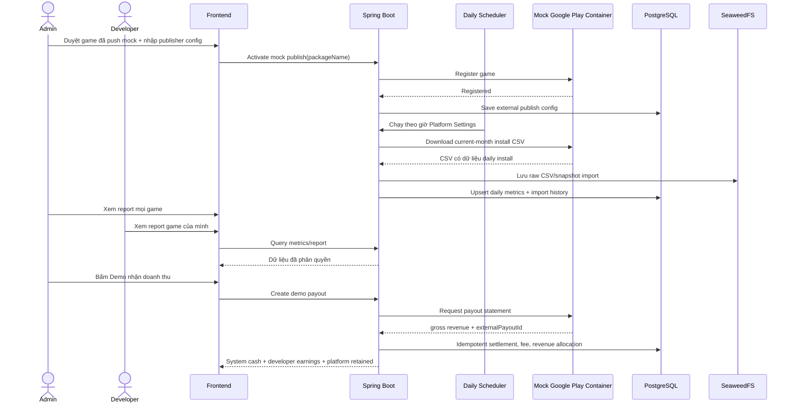

# 27. Google Play Mock Reports & Revenue Share — Plan Demo

> Phạm vi tài liệu: demo luồng game được GodotLaunch phát hành lên Google Play, đồng bộ lượt cài đặt qua CSV và nhận/chia doanh thu qua mock payout.
>
> Hiện tại team chưa có Google Play Console thật. Vì vậy tất cả kết nối Google Play trong tài liệu này là **mock có cấu trúc tương thích với production**, không phải gọi Google thật.

---

## 1. Mục tiêu và quyết định đã chốt

### 1.1 Mục tiêu demo

1. Admin duyệt một game là đã được phát hành lên Google Play ở môi trường mock.
2. Admin cấu hình thông tin publisher mock theo định dạng Google Play.
3. Mock Google Play container sinh lượt cài đặt và cung cấp CSV report theo cấu trúc Google Play.
4. Scheduler backend tải, lưu và parse report hằng ngày.
5. Admin xem toàn bộ thống kê/report; developer chỉ xem game do mình sở hữu.
6. Admin có nút **Demo nhận doanh thu Google Play** để chứng minh luồng store trả tiền về platform ngay tại ngày bảo vệ.
7. Hệ thống trừ phí Google Play 15%, sau đó chia 85% tiền còn lại theo tỷ lệ của hợp đồng.

### 1.2 Quy tắc tài chính mặc định

```text
Gross Store Revenue
  - Google Play service fee 15%
  = Net Store Proceeds 85%
  - Developer revenue share
  = Platform retained revenue
```

- Google Play mock luôn có `serviceFeeRate = 15%`.
- `Net Store Proceeds` là tiền Google Play mock chuyển về tài khoản/ví System của GodotLaunch.
- Tỷ lệ developer/platform được tính **trên 85%**, không tính trên doanh thu gross.
- Ví dụ: gross `1,000,000 VND`, contract developer `80%`:
  - Google fee: `150,000 VND`.
  - Net Store Proceeds: `850,000 VND`.
  - Developer earnings: `680,000 VND`.
  - Platform retained revenue: `170,000 VND`.

### 1.3 Hai khái niệm cần hiển thị tách bạch

Không được coi việc cộng tiền cho developer là tiền mới xuất hiện ngoài `85%`:

- **System settlement cash**: System nhận `85%` từ Google Play mock.
- **Developer payable/earnings**: phần nghĩa vụ hệ thống phải trả developer theo hợp đồng.
- **Platform retained revenue**: phần thực thuộc platform sau khi trừ developer payable.

Màn hình admin nên hiển thị đủ ba số này. Nếu chỉ cộng `85%` vào ví admin rồi lại cộng phần developer vào một ví độc lập mà không có transaction phân bổ, tổng số dư sẽ bị đếm trùng.

---

## 2. Phạm vi và ngoài phạm vi

### Có trong scope

- Google Play **mock** container.
- Cấu hình publisher mock, package name và trạng thái game đã phát hành mock.
- Sinh/download CSV install statistics theo ngày.
- Daily scheduler, import history, raw CSV và thống kê download trên UI.
- Phân quyền admin/developer.
- Nút manual demo payout, hạch toán 15% Google fee và revenue split theo contract.
- Idempotency chống import/payout trùng.

### Ngoài scope

- Đăng ký Play Console, Google Cloud project, service account hoặc bucket thật.
- Upload AAB/APK thật, phát hành thật, Google Play Billing hoặc subscription.
- Đối soát Earnings Report thật theo tháng và payout thật ngày 15.
- App Store.
- Tự động payout từ GodotLaunch về ngân hàng developer. Luồng withdrawal/PayOS hiện có tiếp tục xử lý bước đó.
- Tính doanh thu từ lượt download. Download chỉ là metric; doanh thu mock được sinh/tuyên bố trong payout statement riêng.

---

## 3. Quy chiếu production để không lệch hướng

Google Play production tạo report CSV trong private Google Cloud Storage bucket của publisher, thường có dạng:

```text
gs://pubsite_prod_rev_<publisher-id>
```

Install statistics có file tháng chứa các dòng `Date`; dữ liệu được Google thu thập theo ngày nhưng có thể trễ vài ngày. Backend production đọc bucket bằng service account có quyền Play Console phù hợp và lọc theo `packageName`.

Ở demo, các field sau là **fake nhưng phải đúng định dạng**:

```yaml
fakeBucketUri: gs://pubsite_prod_rev_01234567890987654321
fakeServiceAccountEmail: godotlaunch-play-reports@your-project.iam.gserviceaccount.com
```

Mock adapter sẽ chuyển việc đọc `fakeBucketUri` thành HTTP call nội bộ tới mock container. Khi có account thật, thay mock adapter bằng Google Cloud Storage adapter; phần parse, persistence, UI và accounting không đổi.

---

## 4. Kiến trúc tổng thể



---

## 5. Mock Google Play Container

### 5.1 Trách nhiệm

Container chỉ giả lập external provider. Nó không sửa trực tiếp PostgreSQL GodotLaunch.

- Đăng ký/hủy đăng ký game mock theo `packageName`.
- Sinh metric daily install ngẫu nhiên, có seed để demo tái lập nếu cần.
- Cập nhật CSV tháng hiện hành.
- Trả payout statement giả lập, có `externalPayoutId` bất biến theo game + kỳ.

### 5.2 CSV phải giống hướng Google Play

Ví dụ object path mock:

```text
stats/installs/installs_com.godotlaunch.skyadventure_202608_country.csv
```

Ví dụ nội dung:

```csv
Date,Package Name,Country,Daily User Installs
2026-08-28,com.godotlaunch.skyadventure,VN,3
2026-08-29,com.godotlaunch.skyadventure,VN,5
2026-08-30,com.godotlaunch.skyadventure,VN,2
```

Container cập nhật **cùng file tháng** hằng ngày, thay vì tạo một file nguồn hoàn toàn mới cho từng ngày. Backend lưu snapshot từng lần import để UI vẫn lọc được lịch sử theo ngày sync.

### 5.3 Internal API đề xuất

Các endpoint chỉ mở trong Docker/internal network; frontend không gọi trực tiếp.

```text
POST /internal/v1/apps
DELETE /internal/v1/apps/{packageName}
GET  /internal/v1/reports/installs/{packageName}/{yyyyMM}?dimension=country
POST /internal/v1/payouts
```

`POST /internal/v1/payouts` nhận `packageName`, `periodKey` và trả:

```json
{
  "externalPayoutId": "MOCK-GP-202608-com.godotlaunch.skyadventure",
  "packageName": "com.godotlaunch.skyadventure",
  "periodKey": "2026-08-demo-01",
  "grossRevenue": 1000000,
  "currency": "VND",
  "serviceFeeRate": 15,
  "status": "PAID"
}
```

Nếu cùng `packageName + periodKey` được gọi lại, mock phải trả đúng statement cũ.

---

## 6. Cấu hình và validate admin

### 6.1 Publisher mock configuration

Lưu trong Platform Settings hoặc bảng cấu hình riêng; không lưu credential thật trong source code.

```text
provider = GOOGLE_PLAY_MOCK
bucketUri = gs://pubsite_prod_rev_...
serviceAccountEmail = ...@...iam.gserviceaccount.com
syncCron / dailySyncTime
enabled = true
```

Validation chỉ là validation cú pháp:

- `bucketUri` bắt đầu `gs://pubsite_prod_rev_`, không chứa space/ký tự path không hợp lệ.
- service account theo dạng `<name>@<project>.iam.gserviceaccount.com`.
- daily cron/time hợp lệ.
- không ghi nhận UI rằng backend đã xác thực Google thật.

### 6.2 Kích hoạt game đã publish mock

Admin chỉ có thể kích hoạt sau khi game đã qua review/phê duyệt cần thiết. Mỗi game có một `packageName` unique toàn hệ thống.

```text
Game approved
  -> ADMIN activates Google Play Mock publish
  -> packageName validated
  -> mock container registers packageName
  -> store status = PUBLISHED_MOCK
  -> eligible for daily download sync and demo payout
```

Không được cho developer tự nhập bucket URI, service account hoặc tự xác nhận game đã live.

---

## 7. Mô hình dữ liệu đề xuất

Tận dụng `ExternalPublish` hiện có cho quan hệ game ↔ store publish; bổ sung field/table sau sau khi kiểm tra schema chi tiết.

### 7.1 `ExternalPublish` (bổ sung)

```text
provider                    GOOGLE_PLAY_MOCK
package_name                unique, required when mock published
reporting_enabled           boolean
published_at
mock_registration_id
```

### 7.2 `store_report_imports`

Một row cho một lần scheduler/manual sync tải một nguồn report.

```text
id
provider
external_publish_id
source_object_path
report_month                YYYY-MM
synced_at
raw_file_url
file_checksum
row_count
status                      processing | succeeded | failed
error_message
created_at
```

Unique đề xuất: `(provider, external_publish_id, source_object_path, file_checksum)` để tránh lưu cùng một bản snapshot không đổi quá nhiều lần; vẫn cần lịch sử mỗi scheduler run trong audit log.

### 7.3 `store_daily_install_metrics`

```text
id
external_publish_id
game_id
metric_date
country_code
daily_user_installs
source_import_id
created_at
updated_at
```

Unique bắt buộc: `(external_publish_id, metric_date, country_code)`.

UI dùng tên **Lượt cài đặt người dùng mới** (`Daily User Installs`), không dùng tên mơ hồ “download”.

### 7.4 `store_revenue_statements`

```text
id
external_publish_id
game_id
provider                    GOOGLE_PLAY_MOCK
period_key
external_payout_id          unique
gross_revenue
google_fee_rate             default 15.00
google_fee_amount
net_store_proceeds
developer_share_rate        snapshot từ contract
developer_earnings
platform_retained_revenue
currency
status                      paid | reversed
settled_at
created_at
```

Tỷ lệ hợp đồng phải snapshot vào statement lúc settle để việc sửa hợp đồng sau này không thay đổi lịch sử tài chính.

---

## 8. Luồng daily download sync

### 8.1 Scheduler

Admin cấu hình giờ chạy trong Platform Settings. Có thể tái sử dụng pattern scheduler động hiện có; không hard-code cron trong source.

Mỗi lần chạy:

1. Lấy mọi `ExternalPublish` có `provider=GOOGLE_PLAY_MOCK`, `status=PUBLISHED_MOCK`, `reportingEnabled=true`.
2. Gọi mock container lấy CSV tháng hiện tại theo `packageName`.
3. Validate header, encoding, package name và giá trị install không âm.
4. Lưu raw CSV/snapshot vào SeaweedFS.
5. Tạo `store_report_imports`.
6. Parse CSV; upsert `store_daily_install_metrics` theo unique key.
7. Đánh dấu import `succeeded` hoặc `failed`; lỗi của một game không làm hỏng các game khác.

### 8.2 Idempotency

- Scheduler chạy lại cùng file không được cộng download lần hai.
- Dữ liệu ngày cũ được mock/Google điều chỉnh thì update row metric, không tạo row mới.
- Lưu checksum để audit nguồn dữ liệu đã parse.
- Cần lock hoặc job-run guard để không có hai scheduler import đồng thời cùng game/tháng.

### 8.3 Manual sync

Admin có thể bấm sync một game để demo/khắc phục lỗi, nhưng dùng chung service với scheduler và cùng idempotency rules.

---

## 9. Demo payout và revenue allocation

### 9.1 Điều kiện

- Chỉ admin.
- Game đang `PUBLISHED_MOCK`.
- Có contract revenue-share active và tỷ lệ developer hợp lệ.
- `periodKey` chưa có `externalPayoutId` đã settle.

### 9.2 Xử lý trong một transaction

1. Gọi mock container lấy payout statement.
2. Lock/find `store_revenue_statements` theo `externalPayoutId`.
3. Nếu statement đã `paid`, trả lại kết quả cũ; không tạo transaction mới.
4. Tính Google fee 15%, net proceeds 85%, developer earnings và platform retained revenue.
5. Lưu statement.
6. Ghi transaction nhận settlement vào System.
7. Ghi transaction phân bổ developer earnings vào ví doanh thu/withdrawable balance của developer theo policy hiện có.
8. Ghi transaction platform retained revenue.
9. Cập nhật dashboard/notification nếu có.

### 9.3 Quy tắc hiển thị ví System

Admin cần thấy:

```text
Google Play settlement received: 850,000 VND
Developer payable:             680,000 VND
Platform retained revenue:     170,000 VND
```

Số `850,000` là tiền mặt platform nhận, trong đó `680,000` là nghĩa vụ payout cho developer; chỉ `170,000` là doanh thu giữ lại. Không hiển thị `850,000 + 680,000` như hai nguồn tiền độc lập.

---

## 10. API GodotLaunch đề xuất

### Admin

```text
PUT  /api/v1/admin/platform-settings/google-play-mock
POST /api/v1/admin/store-publishes/{externalPublishId}/activate-mock
POST /api/v1/admin/store-publishes/{externalPublishId}/sync-downloads
POST /api/v1/admin/store-publishes/{externalPublishId}/demo-payout
GET  /api/v1/admin/store-reports/imports
GET  /api/v1/admin/store-reports/metrics
GET  /api/v1/admin/store-reports/imports/{id}/download
GET  /api/v1/admin/store-revenue-statements
```

### Developer

```text
GET /api/v1/developer/store-games
GET /api/v1/developer/store-games/{gameId}/download-metrics
GET /api/v1/developer/store-games/{gameId}/report-imports
GET /api/v1/developer/store-games/{gameId}/reports/{id}/download
GET /api/v1/developer/store-games/{gameId}/revenue-statements
```

Developer APIs luôn kiểm tra game creator/owner ở backend. Không chỉ ẩn menu frontend.

---

## 11. UI đề xuất

### 11.1 Admin: Google Play Mock Management

- Publisher configuration form và badge `MOCK MODE`.
- Danh sách game đã publish mock: package name, trạng thái sync mới nhất, tổng installs, lần sync gần nhất.
- Nút `Sync now`, `Demo nhận doanh thu`, xem payout statement.
- Danh mục report imports: ngày sync, game, source path, checksum, status, raw CSV download.
- Filter: game, trạng thái import, report month, thời gian sync.
- Dashboard tiền: gross, Google fee 15%, system settlement, developer payable, platform retained.

### 11.2 Developer: My Store Performance

- Chỉ các game của developer hiện tại.
- Chart daily user installs, tổng theo khoảng ngày, lần sync gần nhất.
- Danh sách statement cho game: net proceeds, tỷ lệ hợp đồng snapshot, developer earnings, trạng thái.
- Download raw CSV đã lọc chỉ còn dữ liệu game của developer.

---

## 12. Bảo mật và vận hành

- Chỉ lưu fake email/bucket URI trong demo; tuyệt đối không commit service-account JSON thật.
- Mock container không public port ở production-like Docker network.
- Backend mới được gọi mock container; frontend chỉ gọi API GodotLaunch.
- Validate giới hạn kích thước CSV, encoding, header và số row trước parse.
- Audit các hành động: configure mock, activate publish, manual sync, demo payout.
- Mask/không trả toàn bộ report publisher cho developer.
- Chỉ cho phép payout sau khi lock/idempotency `externalPayoutId` thành công.

---

## 13. Kế hoạch triển khai

1. Chốt entity/status và migration: config, report import, daily metric, revenue statement.
2. Tạo mock Google Play container, deterministic seed và internal API.
3. Thêm admin publisher config + activate mock publish; validate bucket URI, service account email, package name.
4. Viết report provider abstraction và mock implementation.
5. Viết parser CSV, SeaweedFS raw-file storage, import history và idempotent upsert metrics.
6. Nối scheduler động với Platform Settings; thêm manual sync.
7. Thêm admin/developer read APIs, authorization và filtered CSV download.
8. Implement demo payout, contract snapshot, ledger transactions và idempotency.
9. Xây UI admin và developer.
10. Test manual flows, lỗi CSV và double-click payout.

---

## 14. Kịch bản nghiệm thu

1. Admin nhập bucket/service account sai format → backend từ chối với lỗi rõ ràng.
2. Admin active game mock với package name trùng → từ chối.
3. Mock tạo ngày có `3` daily user installs → scheduler chạy ngày sau → UI game tăng đúng `3`.
4. Chạy sync lại cùng CSV → tổng không tăng lần hai.
5. Mock thay giá trị của một ngày cũ → metric ngày đó được update, không nhân đôi.
6. Developer A không gọi/xem/download được report của game developer B.
7. Admin bấm demo payout gross `1,000,000`, developer share `80%` → fee `150,000`, net `850,000`, developer `680,000`, platform retained `170,000`.
8. Bấm demo payout lần hai cùng `periodKey` → không có transaction/credit mới.
9. Import CSV lỗi header/encoding → import `failed`, metrics cũ không bị xóa, admin xem được lỗi.

---

## 15. Definition of Done

- Có mock publisher configuration và không yêu cầu Google account thật.
- Có mock container sinh/report CSV theo `packageName` và tháng.
- Scheduler/import manual hoạt động, idempotent và lưu raw report + lịch sử import.
- Admin và developer có UI dữ liệu đúng quyền.
- Manual demo payout tính đúng 15% Google fee và chia 85% theo contract snapshot.
- Không có double count download hoặc double credit tiền khi retry/double click.
- UI và tài liệu đều ghi rõ `MOCK MODE`; production adapter đọc Google Cloud Storage là bước sau.
